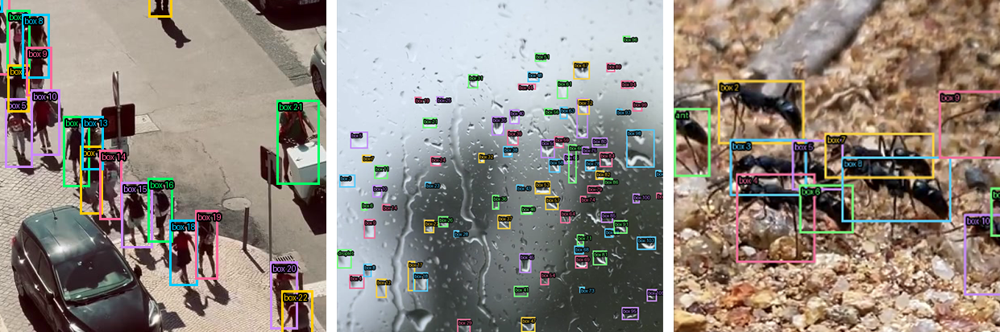
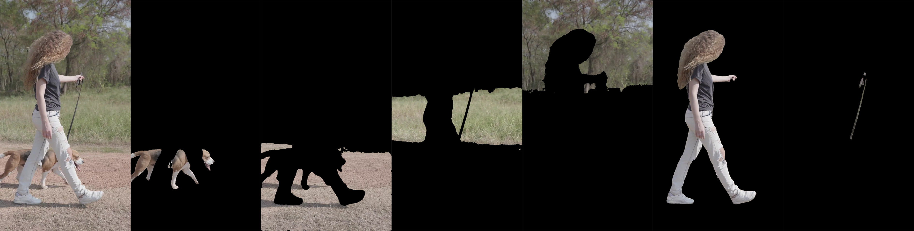
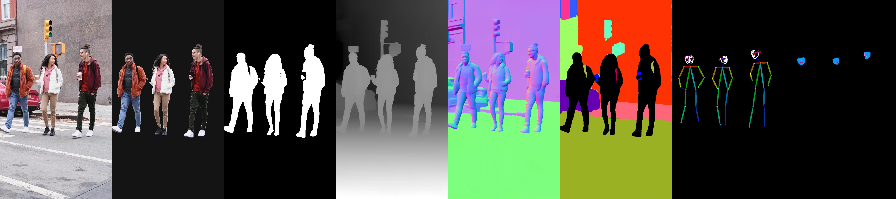
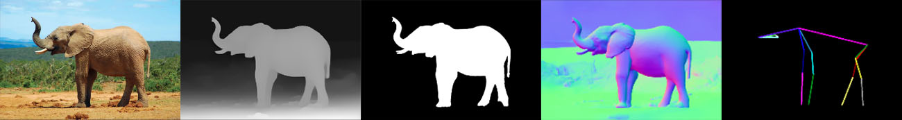
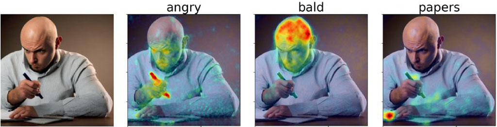

# Computer Vision in ComfyUI

---

## ComfyUI Workflows

### Locate Anything

[A ComfyUI workflow](comfyui_workflows/locate_anything/README.md) for nVidia's *LocateAnything* model, which uses text prompts to perform precise object localization, dense detection, and point-based localization across a wide range of domains.

---

### Segment Anything

This [set of ComfyUI workflows](comfyui_workflows/segment_anything/README.md) demonstrates Meta's *Segment Anything 3.1* model, which produces accurate pixel-level masks for objects specified by natural language text prompts, points, and/or bounding boxes. 

---

### Vision Suite for Humans & Quadrupeds

[A ComfyUI workflow](comfyui_workflows/human_cv/README.md) that demonstrates the use of a variety of analyses of media containing **people**, including (among others): segmentation of the body from the background; monocular depth estimation; scene segmentation; normal map estimation; and pose estimation of the body, face, and hands. 

[A ComfyUI workflow](comfyui_workflows/quadruped_cv/README.md) that computes similar analyses of media featuring quadruped **animals**:

---

### DAAM Concept Activation Heatmaps

[This set of ComfyUI workflows](comfyui_workflows/daam_heatmaps/README.md) provide **heatmaps** that show which parts of an image correspond to specific words in a prompt, as measured by activations in a Stable Diffusion model. This can be even be used for adjectives like "angry" and "bald". 

---

### DINOv3 Image Similarity Heatmaps

[This ComfyUI workflow](comfyui_workflows/dinov3_image_similarity/README.md) provides heatmaps that show which parts of an image are similar to a provided query point.  

