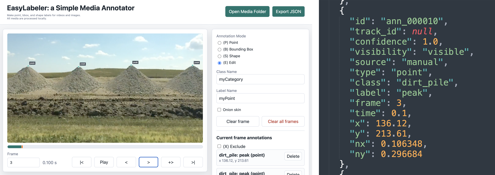
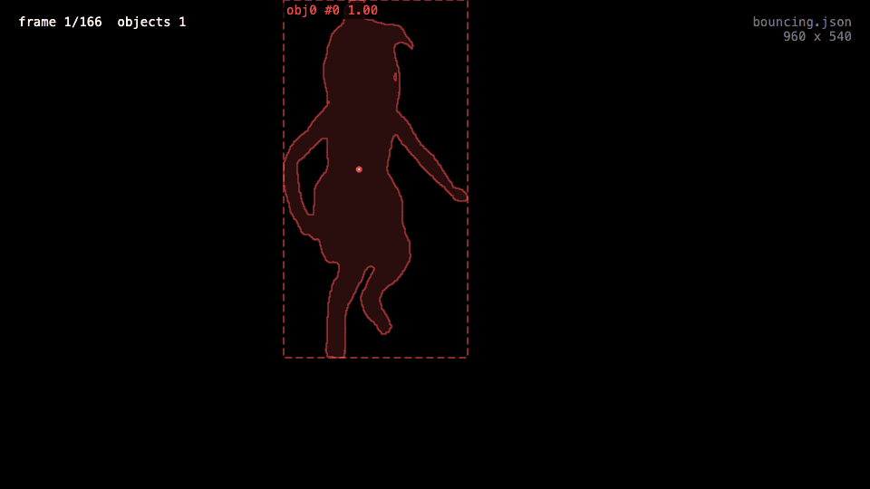
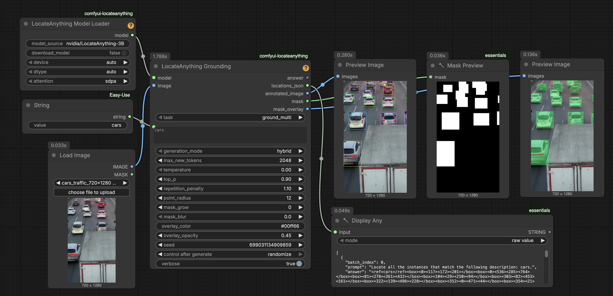
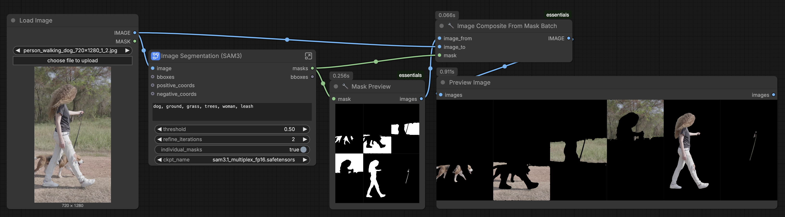
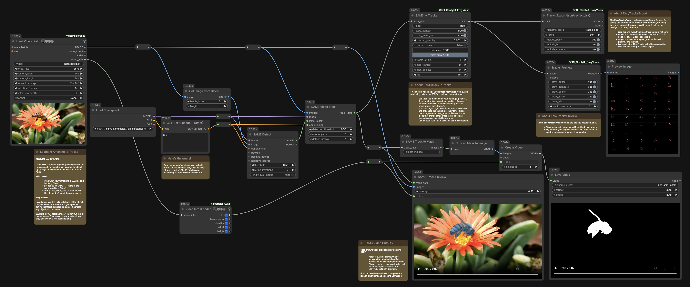
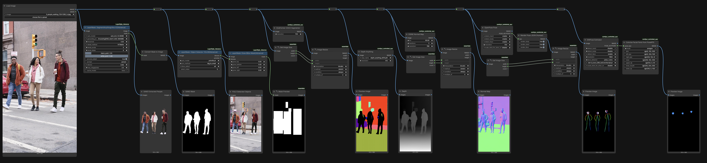

# EasyVision & ComfyCV

> *A Modular AI Toolkit for Computational Perception in the Arts*

This is a collection of pedagogic computer vision tools and resources developed by Prof. [Golan Levin](https://github.com/golanlevin) and student research assistants, [Claire Vlases](https://github.com/cvlases) and [Lorie Chen](https://github.com/ylchen333). This work was developed as part of the Summer 2026 CFA GenAI Toolmaking for the Arts Residency at Carnegie Mellon University, supported by the College of Fine Arts and the Frank-Ratchye STUDIO for Creative Inquiry.

---

## Contents

* **Overview**
* **EasyVision Software Tools**
  * [EasyLabeler](#easylabeler)
  * [EasyTrain (YOLO)](#easytrain-yolo)
  * [EasyTrack Viewer](#easytrack-viewer)
* [**ComfyCV: ComfyUI Workflows for Computer Vision**](#comfycv-comfyui-workflows-for-computer-vision) A collection of workflows for visual detection, localization, segmentation, and analysis. 
  * [Locate Anything](#locate-anything)
  * [Segment Anything](#segment-anything)
  * [Segment Anything to Contours](#segment-anything-to-contours)
  * [Vision Suite for Humans & Quadrupeds](#vision-suite-for-humans--quadrupeds)
  * [DAAM Concept Activation Heatmaps](#daam-concept-activation-heatmaps)
  * [DINOv3 Image Similarity Heatmaps](#dinov3-image-similarity-heatmaps)

---

## Overview

*[This needs to be completed]*

* **EasyLabeler**, a browser-based tool for annotating visual media
* **EasyTrain**, for training custom YOLO detectors using EasyLabeler annotations
* **EasyDetect**, a ComfyUI workflow for detecting items of interest, using a combination of custom-trained YOLO detectors and state-of-the art models like *Locate Anything* and *Segment Anything*.
* **EasyTrack**, a ComfyUI workflow for tracking EasyDetected items using models like e.g. CoTrack. 

In addition, we present **ComfyCV**, a loose collection of workflows for the ComfyUI generative-AI programming environment. ComfyCV provides r

### Educational Context

*[This needs to be completed]*

* Experimental Capture
* Typology Machine Assignment

### Use and Installation Requirements

Interested persons should anticipate using the following tools: 

* **ComfyUI**. Workflows are provided specifically for the RunComfy.com cloud-computing service. It is recommended you obtain an account there. 
* **Python**. Some of the tooling presented here expects you to have a local installation of Python 3.10+. To preserve the integrity of your machine, it is recommended you always create a virtual environment ("venv") for all Python work.
* **ffmpeg**. This is a powerful command-line tool for processing image and video media, especially in large batches.
* Comfort using the macOS **Terminal** application will also be very handy. 

---

## EasyVision Software Tools

---

### EasyLabeler

[**EasyLabeler**](easylabeler/README.md) is a browser-based utility for annotating videos or image collections with points, bounding boxes, and closed polygonal shapes. It works entirely locally; uses plain HTML, CSS, and JavaScript; and produces JSON annotation files. 

Datasets annotated with EasyLabeler can be used to train custom detectors with [EasyTrain](easytrain-yolo/README.md) (see below). EasyLabeler and EasyTrain can be useful when the thing you wish to detect is not easy to describe in words.

--- 

### EasyTrain (YOLO)

[**`easytrain-yolo`**](easytrain-yolo/README.md) is a command-line tool for custom-training an Ultralytics YOLO computer vision model, in order to recognize and locate objects in images and video. In order to train the detector, [EasyTrain](easytrain-yolo/README.md) consumes annotations created with [EasyLabeler](https://github.com/CreativeInquiry/ComfyCV/tree/main/easylabeler) (see above). EasyTrain [includes a ComfyUI workflow](easytrain-yolo/README.md#6-use-your-model-in-comfyui) that demonstrates the end-to-end use of the `comfyui-ultralytics-yolo` node with a custom-trained model.

---

### EasyTrack Viewer

 

[**EasyTrack Viewer**](easytrack_viewer/README.md) is a browser-based tool for previewing the JSON files produced by other EasyTracking apps (such as [Segment Anything to Contours](#segment-anything-to-contours), below). Additionally, it can convert these JSON data into numerous other formats, such as CSV, SVG, GIF, and specialized animation formats for use with AfterEffects, Blender, and Maya.

---

## ComfyCV: ComfyUI Workflows for Computer Vision

In addition to the *EasyVision* suite of tools and workflows for computer vision, we also offer these self-contained workflows for performing select computer vision tasks in ComfyUI.

### Locate Anything

[A ComfyUI workflow](comfyui_workflows/locate_anything/README.md) for nVidia's powerful *LocateAnything* model, which uses text prompts to perform precise object localization, dense detection, and point-based localization across a wide range of domains.

---

### Segment Anything

This [set of ComfyUI workflows](comfyui_workflows/segment_anything/README.md) demonstrates Meta's *Segment Anything 3.1* model, which produces accurate pixel-level masks for objects specified by natural language text prompts, points, and/or bounding boxes. Workflows are provided for images, video, and image batches.

---

### Segment Anything to Contours

This [ComfyUI workflow](comfyui_workflows/segment_anything_to_contours/README.md) extends Segment Anything with custom nodes that allow you to export sequences of vector-based contours of tracked objects. These sequences may than be viewed and transcoded using [EasyTrack Viewer](#easytrack-viewer) (see above). 

---

### Vision Suite for Humans & Quadrupeds

[A ComfyUI workflow](comfyui_workflows/human_cv/README.md) that demonstrates the use of a variety of analyses of media containing **people**, including (among others): segmentation of the body from the background; monocular depth estimation; scene segmentation; normal map estimation; and pose estimation of the body, face, and hands. 

[A related ComfyUI workflow](comfyui_workflows/quadruped_cv/README.md) computes similar analyses of media featuring quadruped **animals**:

---

### DAAM Concept Activation Heatmaps

[This set of ComfyUI workflows](comfyui_workflows/daam_heatmaps/README.md) provide heatmaps that show which parts of an image correspond to specific words in a prompt, as measured by activations in a Stable Diffusion model. This can be even be used for adjectives like "angry" and "bald". 

---

### DINOv3 Image Similarity Heatmaps

[This ComfyUI workflow](comfyui_workflows/dinov3_image_similarity/README.md) provides heatmaps that show which parts of an image are similar to a provided query point.  

