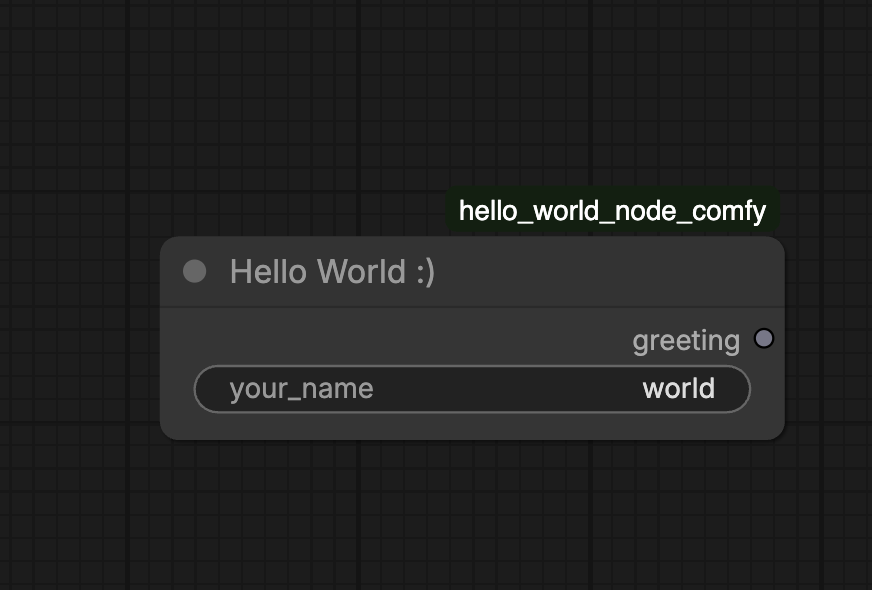
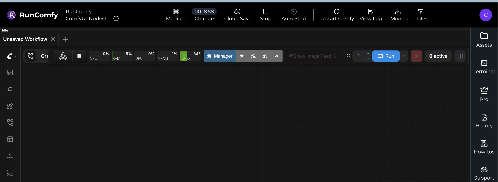
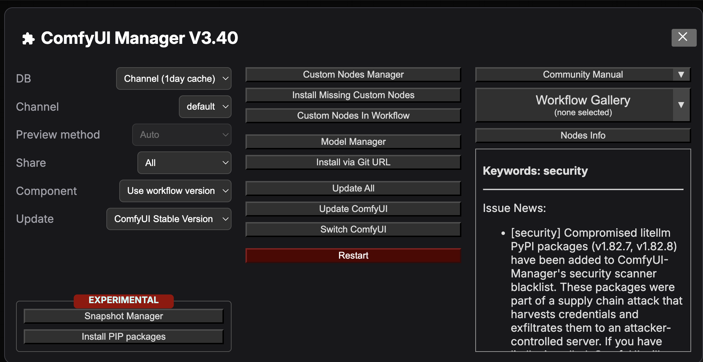
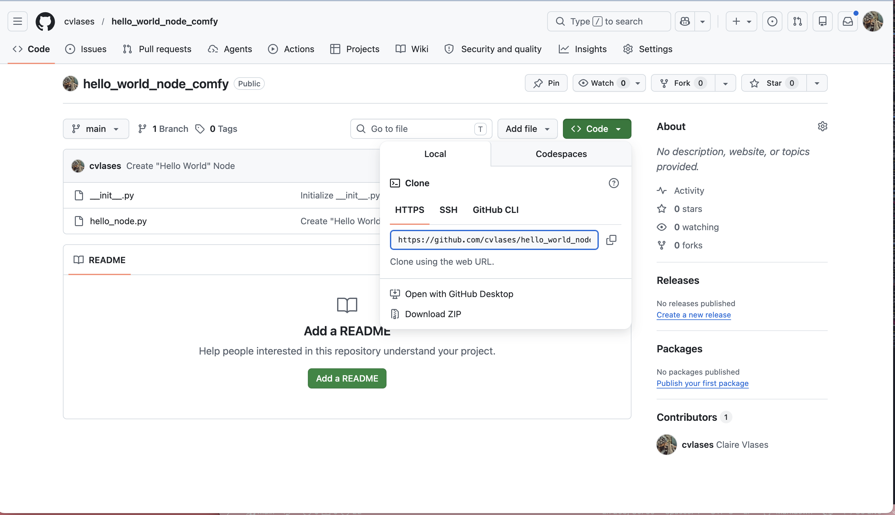
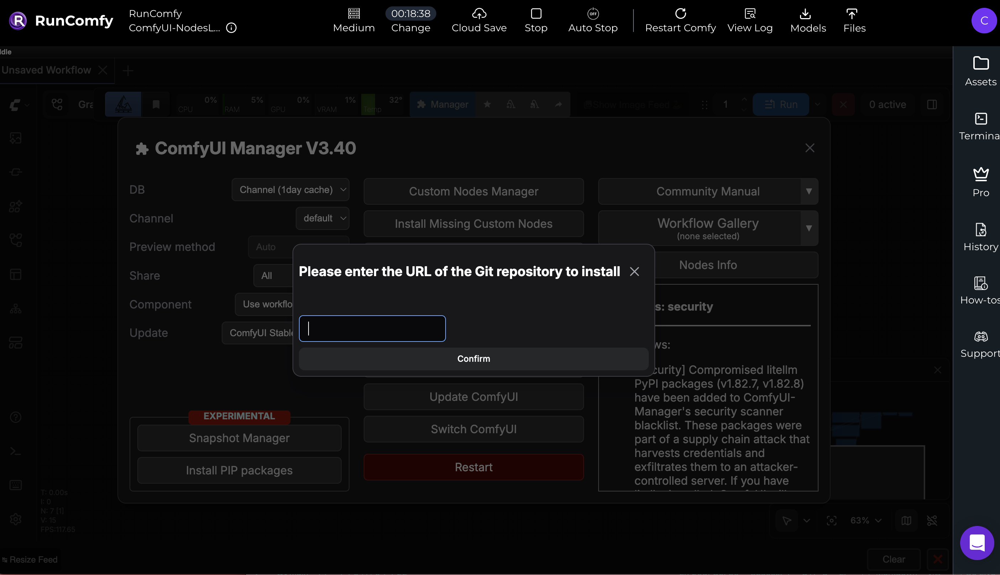
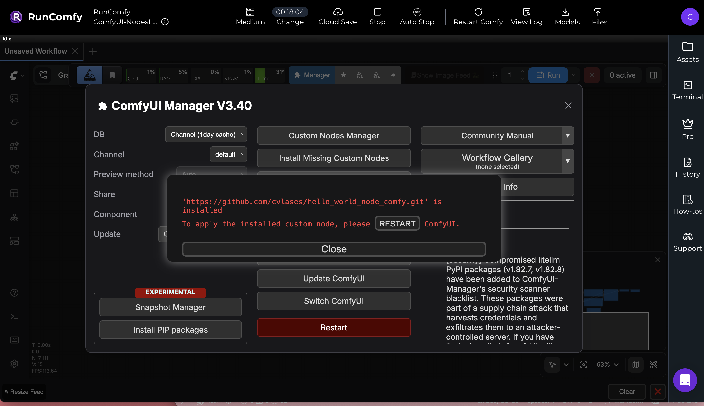
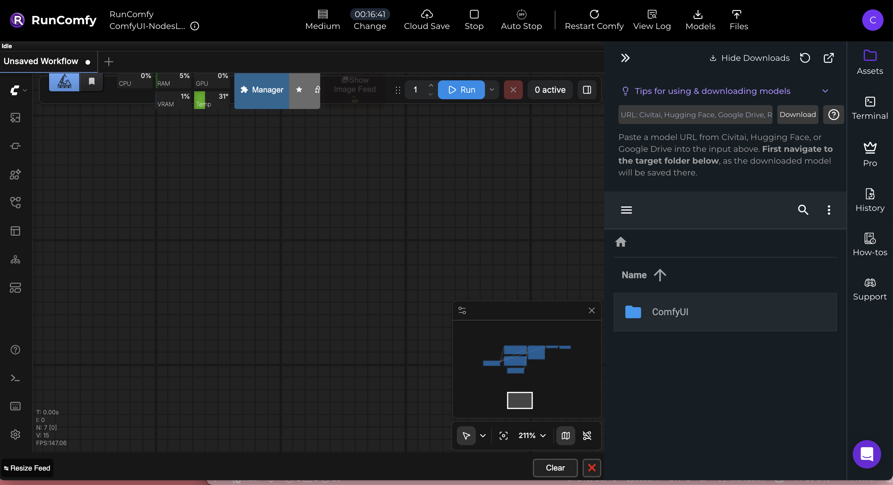
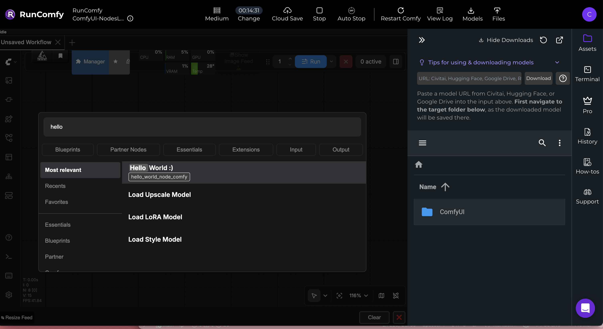
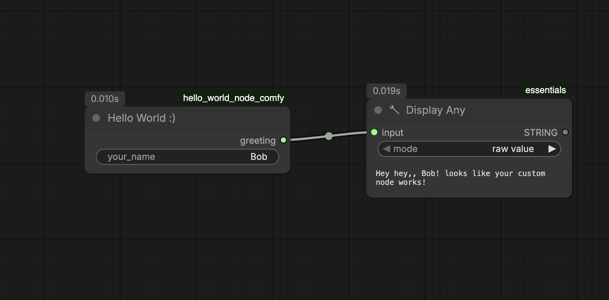

# Building & Deploying a Custom ComfyUI Node on RunComfy
### A beginner-friendly guide for a "Hello World" node, imported onto cloud GPU

> **Who this is for:** Anyone who wants to make their own custom node in ComfyUI, and/or add a custom node to RunComfy.

This tutorial is adapted from [this reddit post](https://www.reddit.com/r/comfyui/comments/18wp6oj/tutorial_create_a_custom_node_in_5_minutes/), plus my own suffering. Cheers!

---

## Table of Contents

1. [What Even Is a Custom Node?](#what-even-is-a-custom-node)
2. [Your First Node: Hello World](#your-first-node-hello-world)
3. [Widgets: Adding Controls](#widgets-adding-controls)
4. [Inputs: Making Dot Connectors](#inputs-making-dot-connectors)
5. [Outputs: Sending Data Forward](#outputs-sending-data-forward)
6. [Naming Your Node](#naming-your-node)
7. [Setting Up Your GitHub Repo](#setting-up-your-github-repo)
8. [Installing on RunComfy](#installing-on-runcomfy)
9. [Debugging on RunComfy](#debugging-on-runcomfy)
10. [Gotchas & Tips](#gotchas--tips)

---

## What Even Is a Custom Node?

ComfyUI's entire interface is made of **nodes**, boxes you connect together with noodles. Every single one of them, from `Load Image` to `KSampler`, is just a Python class underneath the GUI.

That means *you* can make one, and it'll look and feel exactly like the built-in ones!

Let's break down what a node is made of:
- The node (the box itself)
- A name
- **Widgets** — controls you can change by hand, like sliders or text boxes
- **Input dots** — connections that receive data from other nodes
- **Output dots** — connections that send data to other nodes



---

## Your First Node: Hello World

Let's build the simplest possible node: it possess a textbox where the user can input a name. Connect it to a text/string display node, and you will find a friendly message!  

### Step 1: Create the folder structure

In your code editor (I use VSCode) create a `ComfyUI/custom_nodes/` directory, following this structure:

```
custom_nodes/
  hello-world-node/
    __init__.py
    hello_node.py
```

> The folder name can be anything. The `__init__.py` is what tells Python (and ComfyUI) "hey, this folder is a package." Without it, ComfyUI won't find your node.

### Step 2: Write the node

Create `hello_node.py` and paste this in:

```python
class HelloWorldNode:
    """
    The simplest possible ComfyUI node.
    Takes a text input, returns it with a greeting.
    """

    @classmethod
    def INPUT_TYPES(cls):
        return {
            "required": {
                "your_name": ("STRING", {"default": "Golan"}),
            }
        }

    RETURN_TYPES = ("STRING",)
    RETURN_NAMES = ("greeting",)
    FUNCTION = "greet"
    CATEGORY = "tutorials/hello-world"

    def greet(self, your_name):
        message = f"Hey hey, {your_name}! looks like your custom node works!"
        print(f"[HelloWorld] {message}")  # shows in the ComfyUI terminal
        return (message,)


# These two dicts are what ComfyUI actually reads at startup
NODE_CLASS_MAPPINGS = {
    "HelloWorld": HelloWorldNode,
}

NODE_DISPLAY_NAME_MAPPINGS = {
    "HelloWorld": "Hello World :)",
}
```

---

### Step 3: Write the `__init__.py`

The init file is super small, just two lines! It just re-exports the mappings so ComfyUI can find them:

```python
from .hello_node import NODE_CLASS_MAPPINGS, NODE_DISPLAY_NAME_MAPPINGS

__all__ = ["NODE_CLASS_MAPPINGS", "NODE_DISPLAY_NAME_MAPPINGS"]
```

---
 
## Understanding the Anatomy
 
Before we go further, let's break down what each part of that class actually does.
 
```python
@classmethod
def INPUT_TYPES(cls):
    return {
        "required": {
            "your_name": ("STRING", {"default": "world"}),
        }
    }
```

This is where you tell ComfyUI what goes into your node. Each entry has three things:

The name (`your_name`): becomes the label on the node
The type (`STRING`): what kind of data it accepts
The options (`{"default": "world"}`): a dictionary form of extra settings like a default value, or min/max for numbers
 
```python
RETURN_TYPES = ("STRING",)
RETURN_NAMES = ("greeting",)
```
 
This outputs are what come out of your node. `RETURN_TYPES` sets the data type (which also controls the wire color, since strings are one color, images are another...). `RETURN_NAMES` is just the label you'll see on the output dot.


Note: even for a single output, you need the trailing comma `("STRING",)` (classic python making everyone's life hard).


 
```python
FUNCTION = "greet"
```
 
This tells ComfyUI which method to run when the node executes. It must exactly match the method name below.
 
```python
CATEGORY = "tutorials/hello-world"
```
 
This is the file path, of where your node shows up in the right-click menu. The slash creates a subfolder, so this would appear under tutorials → hello-world
 
```python
def greet(self, your_name):
    ...
    return (message,)
```
 
This is the function that actually does something. The parameter names have to match what you defined in INPUT_TYPES. Don't forget that trailing comma!
 
---
 
## Widgets: Adding Controls
 
Widgets are inputs you can change directly on the node, like a text box, a number slider, or a dropdown.
 
In `INPUT_TYPES`, add a line like this inside the `"required"` block:
 
```python
"my_text": ("STRING", {"default": "Hello!"}),
```
 
Here's what the types look like for common widgets:
 
```python
"my_string":  ("STRING",  {"default": "some text"}),
"my_int":     ("INT",     {"default": 5, "min": 0, "max": 100, "step": 1}),
"my_float":   ("FLOAT",   {"default": 0.5, "min": 0.0, "max": 1.0, "step": 0.01}),
"my_bool":    ("BOOLEAN", {"default": True}),
"my_choice":  (["option_a", "option_b", "option_c"], {"default": "option_a"}),
```
 
 
> Whenever you change inputs, outputs, or widgets on an existing node, **remove it from your workflow before testing**. Updating a node that's already in a workflow can cause unpredictable behavior. Always delete it and re-add it fresh.
 
---
 
## Inputs: Making Dot Connectors
 
Sometimes you want an actual input, so you can hook up other nodes as inputs to your node. 
 
To turn any input into a dot connector instead of a widget, add `"forceInput": True`:
 
```python
"input_image": ("IMAGE",  {"forceInput": True}),
"input_text":  ("STRING", {"forceInput": True}),
```
 
Now instead of a text box on the node, you'll see a dot that accepts a wire from another node's output.
 
Common types for dot inputs:
 
| Type | What it carries |
|------|----------------|
| `"IMAGE"` | Image tensors (batch, H, W, C) |
| `"LATENT"` | Latent space representations |
| `"MODEL"` | Diffusion models |
| `"CONDITIONING"` | Text embeddings / prompts |
| `"STRING"` | Plain text |
| `"INT"` | Integers |
| `"FLOAT"` | Floats |
 
---
 
## Outputs: Sending Data Forward
 
Outputs are defined by two lines:
 
```python
RETURN_TYPES  = ("IMAGE", "STRING", "INT")
RETURN_NAMES  = ("processed_image", "label", "count")
```
 
`RETURN_TYPES` controls the wire color and type-compatibility. `RETURN_NAMES` is just the display label. The number of entries must match between both lines.
 
Your function then returns a tuple with the same number of values, in the same order:
 
```python
def run(self, ...):
    return (my_image, my_label, my_count)
```
 
Types are always written in ALL CAPS. 
---
 
## Naming Your Node
 
There are actually **two names** every node needs:
 
**1. The class key in `NODE_CLASS_MAPPINGS`**. This is a unique internal ID. It's how ComfyUI identifies your node in saved workflows.
 
**2. The display name in `NODE_DISPLAY_NAME_MAPPINGS`**. This is what shows up in the UI.
 
```python
NODE_CLASS_MAPPINGS = {
    "HelloWorld": HelloWorldNode,       # internal ID
}
 
NODE_DISPLAY_NAME_MAPPINGS = {
    "HelloWorld": "Hello World :)",     # shown in the UI
}
```
 
If you have multiple nodes, each one gets an entry in both dicts:
 
```python
NODE_CLASS_MAPPINGS = {
    "HelloWorld":  HelloWorldNode,
    "ColorBorder": ColorBorderNode,
}
 
NODE_DISPLAY_NAME_MAPPINGS = {
    "HelloWorld":  "Hello World :)",
    "ColorBorder": "Color Border 🎨",
}
```
 
> The class key must be **globally unique** across all installed nodes. If two nodes share the same key, one will silently overwrite the other. A good habit is to prefix with your project name: `"MyProject_HelloWorld"`.
 
---
 
## Setting Up Your GitHub Repo
 
To install a custom node on RunComfy, it needs to be on GitHub. Here's the minimal repo structure:
 
```
your-node-repo/
  __init__.py
  your_nodes.py
  README.md           ← optional but good practice
  pyproject.toml      ← optional but good practice
```
 
### Minimal `pyproject.toml`
 
```toml
[project]
name = "my-comfy-node"
version = "1.0.0"
description = "My custom ComfyUI node"
requires-python = ">=3.10"
dependencies = []   # list any pip packages your node needs here
 
[tool.comfy]
PublisherId = "your-github-username"
DisplayName = "my-comfy-node"
```
 
Your repo URL (e.g. `https://github.com/yourusername/your-node-repo`) is what you'll paste into ComfyUI Manager.
 
---
 
## Installing on RunComfy
 
RunComfy is a cloud GPU platform that runs ComfyUI. Installing custom nodes there is a little different from local — you can't just drag files around.
 
> **Tip:** I found it much easier to develop and test nodes locally first. That way you can iterate quickly before dealing with the cloud. I'll write a guide on running ComfyUI locally soon! And of course, **never run a random person's custom node locally on your own machine** without reading the code first. You have no idea what's in there. Best not to do it at all.
 
### Method 1: ComfyUI Manager GUI (easiest)
 
This is the friendliest option for beginners.
 
1. Launch a new machine on RunComfy
2. Click **Manager** in the top menu

3. Click **Install via Git URL**

4. Paste your GitHub repo link (e.g. `https://github.com/yourusername/your-node-repo`)


5. Click **Install**
6. When it finishes, click **Restart**

7. Close the Manager
8. In the RunComfy dashboard, check **Assets → ComfyUI → custom_nodes**. You should see your folder there

9. **Hard refresh** your browser tab: `Cmd+Shift+R` (Mac) or `Ctrl+Shift+R` (Windows/Linux.
10. Double-click the canvas and search for your node name

To verify it works, wire it to a **Display Any** node (or **Show Text**) and queue a prompt. You should see your greeting pop up!

 
### Method 2: Terminal (for advanced use)
 
If you prefer the terminal, RunComfy gives you a restricted terminal from the instance dashboard.
 
```bash
cd /workspace/ComfyUI/custom_nodes
git clone https://github.com/yourusername/your-node-repo.git
```
 
If your node has dependencies:
 
```bash
pip install -r your-node-repo/requirements.txt
# or install packages directly:
pip install package-name-1 package-name-2
```
 
> ⚠️ **RunComfy terminal is restricted.** Allowed commands: `cd`, `ls`, `cat`, `cp`, `mv`, `rm`, `mkdir`, `git`, `pip`, `pip3`, `curl`, `wget`, `vim`. Commands like `python`, `find`, and `grep` are blocked.
 
Then restart the ComfyUI server from the RunComfy dashboard, and hard refresh your browser.
 
---
 
## Debugging on RunComfy
 
When a node doesn't show up, don't panic!!!!
 
### Step 1: Check the startup log
 
In RunComfy, click **View Log** in the top menu. 


Look for your node's folder name in the imports section of the log.
 
- **It's there but the node doesn't appear** → hard refresh your browser first (`Cmd/Ctrl+Shift+R`). 
- **It's not there at all** → there's a silent import error. Go to Step 2.

### Step 2: Add debug output to `__init__.py`
 
ComfyUI sometimes hides the import errors so one bad node doesn't crash the whole app. 
 
Edit your `__init__.py` with vim:
 
```bash
vim /workspace/ComfyUI/custom_nodes/your-node-repo/__init__.py
```
 
Inside vim: press `i` to enter insert mode, make your edits, then press `Esc` and type `:wq` to save and quit.
 
Replace the contents with this:
 
```python
try:
    from .your_nodes import NODE_CLASS_MAPPINGS, NODE_DISPLAY_NAME_MAPPINGS
    print("=== MY NODE LOADED OK ===", NODE_CLASS_MAPPINGS)
except Exception as e:
    print("=== MY NODE LOAD ERROR ===", e)
    NODE_CLASS_MAPPINGS = {}
    NODE_DISPLAY_NAME_MAPPINGS = {}
 
__all__ = ["NODE_CLASS_MAPPINGS", "NODE_DISPLAY_NAME_MAPPINGS"]
```
 
Restart ComfyUI and check the log. You'll see either `=== MY NODE LOADED OK ===` with your class names listed, or `=== MY NODE LOAD ERROR ===` followed by the exact error message.
 
### Step 3: Verify dependencies are installed
 
```bash
pip show package-name
```
 
### Common errors and fixes
 
| Symptom | Likely cause | Fix |
|---|---|---|
| Node not in UI after restart | Stale browser cache | Hard refresh (`Cmd/Ctrl+Shift+R`) |
| Loaded in log but no nodes appear | Silent import error | Add try/except to `__init__.py` |
| `ModuleNotFoundError` in log | Missing pip package | `pip install package-name` |
| `NODE_CLASS_MAPPINGS` not found | Missing from `__init__.py` | Check your exports |
| Node appears red in workflow | Input/output schema changed | Remove node and re-add it |
 
---
 
## Gotchas & Tips
 
**Always restart the server after changes.** Unlike web dev, there's no hot reload. 
 
**Remove and re-add nodes when you change their schema.** If you add, remove, or rename inputs/outputs on a node that's already in your workflow, the old version in the canvas won't update automatically. Delete it and drag a fresh one in.
 
**RunComfy may reset between sessions.** Installed packages might not persist depending on your plan. If your node keeps losing dependencies on restart, check if you're on a persistent storage tier.
 
**One class per node, all registered in the mappings.** You can have multiple node classes in one `.py` file or across multiple files — just make sure every single one ends up in `NODE_CLASS_MAPPINGS`.
 
---
 
## Resources
 
- [ComfyUI Custom Node How-To Wiki](https://github.com/chrisgoringe/Comfy-Custom-Node-How-To/wiki) — community-written, incomplete but useful
- [ComfyUI Registry](https://docs.comfy.org/registry/publishing) — how to publish your node publicly
- [ComfyUI JS Extensions](https://docs.comfy.org/custom-nodes/js/javascript_overview) — for adding custom UI to your nodes
- [Original Reddit Tutorial](https://www.reddit.com/r/comfyui/comments/18wp6oj/tutorial_create_a_custom_node_in_5_minutes/)
---
 
*Made with frustration, perseverance, and a lot of terminal typos. Good luck!*