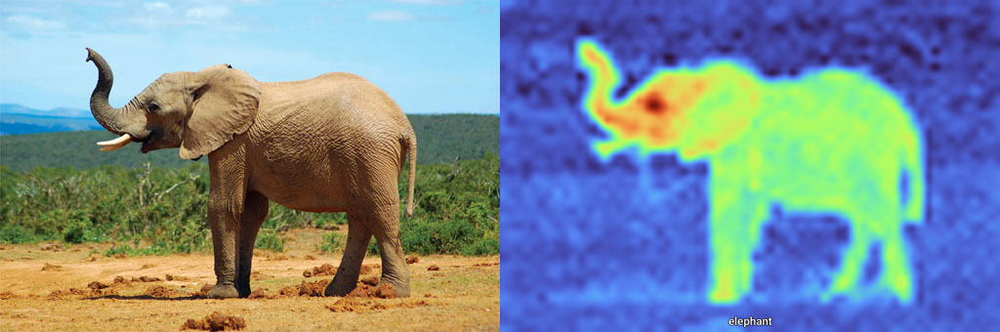
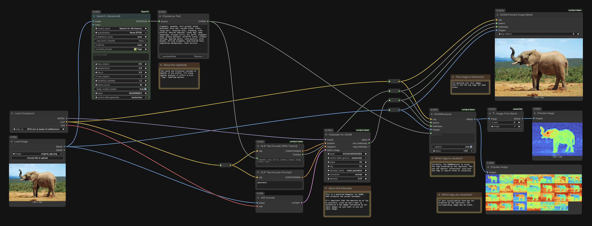
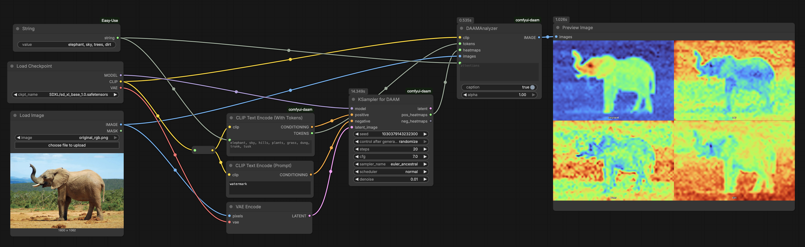
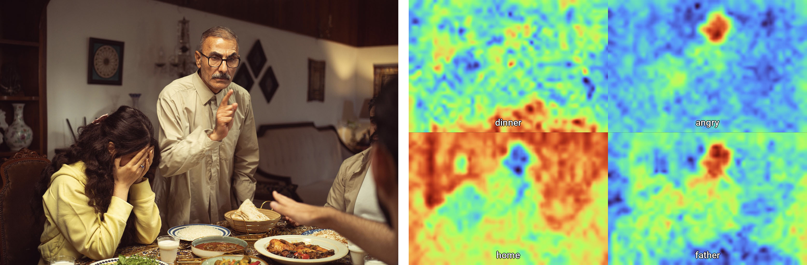

# DAAM Heatmaps

 
Input image and heatmap produced by DAAM for the term `elephant`, showing which pixels were most activated by the SDXL model by that term. 

---

## About DAAM 

[**Diffusion attentive attribution maps**](https://github.com/castorini/daam) (DAAM, by Tang et al.) are a method for interpreting the behavior of Stable Diffusion models. DAAM provides "heat maps" that show exactly which parts of the image correspond to specific words in the prompt. You can use DAAM as a method for analyzing images! But note that what's really going on here is that you're visualizing how a particular Stable Diffusion model is activated by your term of interest. There is a DAAM [GitHub repo](https://github.com/castorini/daam), [paper](https://aclanthology.org/2023.acl-long.310), [Huggingface demo](https://huggingface.co/spaces/tetrisd/Diffusion-Attentive-Attribution-Maps), and [online documentation](https://castorini.github.io/daam/).

DAAM might be useful in identifying: 

* diffuse objects that are not easily segmentable; 
* parts of images that are correlated to abstract concepts

[**ComfyUI-DAAM**](https://github.com/nisaruj/comfyui-daam/tree/main) is a ComfyUI node that wraps the DAAM algorithm, developed by Nisaruj Rattanaaram. There is a [GitHub repo](https://github.com/nisaruj/comfyui-daam/tree/main) with [documentation](https://github.com/nisaruj/comfyui-daam/tree/main#-daam-nodes) and [sample workflows](https://github.com/nisaruj/comfyui-daam/tree/main/workflows), and it is available on the [Comfy Registry](https://registry.comfy.org/nodes/comfyui-daam) and Custom Node Manager.

---
## Workflows

In this annotated workflow, an image is analyzed by a QwenVL captioner, which automatically produces a set of descriptive tags for the provided image. Those tags then guide a KSampler which has been specially modified to produce DAAM heatmap data. The heatmaps are then decoded and converted into images. The original [input image is here](daam_workflow/original_rgb.png), a [workflow JSON is here](daam_workflow/comfyui_analysis_with_DAAM_heatmaps_workflow.json), and a ["workflow image" is here](daam_workflow/comfyui_analysis_with_DAAM_heatmaps_workflow.png) (i.e. a screenshot with a ComfyUI workflow embedded in its metadata):

Below is a simplified version of the above workflow, which is driven by tags that are user-defined, rather than automatically generated. The original [input image is here](daam_workflow/original_rgb.png), a [workflow JSON is here](daam_simple_workflow/comfyui_daam_simple_workflow.json), and a ["workflow image" is here](daam_simple_workflow/comfyui_daam_simple_workflow.png):

### Instructions

* In RunComfy.com, running `RunComfy/ComfyUI-NodesLoaded`, do: *C->File->Open->comfyui_daam_simple_workflow.png* in order to upload the (simplified) workflow. 
* Several nodes will be marked in red, indicating that they need you to load them. Click *Manager->Install Missing Custom Nodes*. The Manager should present you with **ComfyUI-DAAM** (#850); click the *Install* button to install it. This workflow was tested with DAAM version 0.5.0.
* As usual, click the red **Restart** button in the Manager to restart the ComfyUI server. After doing so, RunComfy may also ask you to refresh the browser page, which you should do. 
* You may need to upload [original_rgb.png](daam_simple_workflow/original_rgb.png), which is the sample (elephant) input image for the provided demo. To do this, you can click *Assets->[⋮]->Upload->File*, or you can click "choose file to upload" in the `Load Image` node on the left of the network.
* Click *Run* to execute the workflow. You can change the heatmap terms using the comma-separated list in the `String` node on the left of the workflow.
* **Caution**: this workflow can be very slow if you use a large input image. Consider resizing large input images using an `Image Resize` node, as shown in [this alternatve version of the workflow](daam_simple_workflow/comfyui_daam_simple_workflow_with_resize.json).
* **Note:** Just as with stable diffusion image *synthesis*, using different random seeds may produce different results as different parts of the network become activated; think of this as giving the image to different "observers". Run the workflow several times to get the best results. 

### Expected Outputs

For a given input image, and a set of activation terms, you should receive a set of heatmap images showing the activation for each term. The text caption burned into each heatmap can be disabled in the `DAAMAnalyzer` node. 

---

