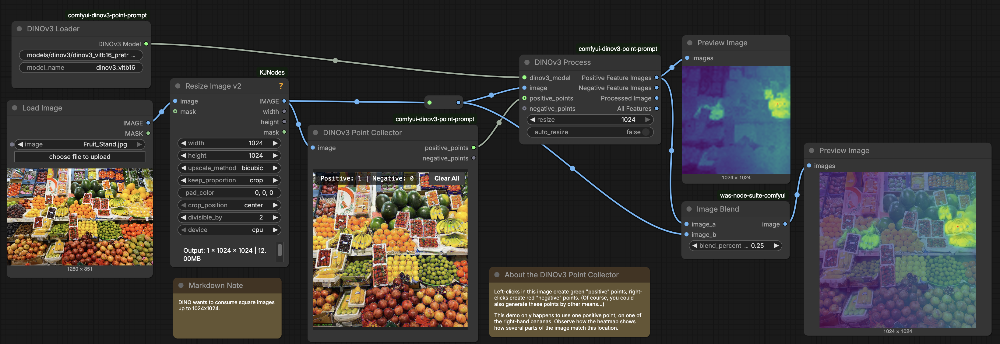

# DINOv3 Heatmaps

 *Input image (left); DINO heatmap produced by a "positive" point placed on one of the right-hand bananas (center); composite image (right).*

---

## About DINOv3

[**DINOv3**](https://github.com/facebookresearch/dinov3)  represents every small patch of an image as a high-dimensional feature vector that captures its visual appearance and semantic context. Because patches with similar visual meaning receive similar feature vectors, you can use DINOv3 to generate similarity heatmaps, find repeated structures or materials, cluster regions by appearance, match corresponding parts across images, and serve as a foundation for tasks like segmentation, tracking, and image retrieval. Treat DINOv3 as a tool for measuring visual similarity rather than recognizing predefined object categories, allowing you to explore images in terms of recurring patterns, textures, forms, and relationships that may not have conventional names.

Key links: 

* [DINOv3 offical repo](https://github.com/facebookresearch/dinov3) 
* [ComfyUI node GitHub](https://github.com/xuheyao/comfyui-dinov3-point-prompt)
* [Model download source](https://huggingface.co/jaychempan/dinov3/blob/main/dinov3_vitb16_pretrain_lvd1689m-73cec8be.pth)
* [Explanation video on Instagram](https://www.instagram.com/reels/DaiDslIORv-/)
* [Paper](https://arxiv.org/abs/2508.10104)

---

## Instructions for Installing and Using DINOv3

### 1. Install the DINOv3 node itself.

* In RunComfy.com, open the Manager and select *Install Custom Nodes*. 
* Search for DINOv3, and install `comfyui-dinov3-point-prompt`.
* As usual, Restart the ComfyUI server (red button) and refresh the browser. 

### 2. Install the codebase from Facebook Research.

The [`comfyui-dinov3-point-prompt`](https://github.com/xuheyao/comfyui-dinov3-point-prompt) ComfyUI node is a thin wrapper on the [DINOv3 algorithm by Facebook Research](https://github.com/facebookresearch/dinov3). The node itself does not include or redistribute the Facebook Research code. For this reason, the node's creator @xuheyao provides the following [instructions](https://github.com/xuheyao/comfyui-dinov3-point-prompt) for downloading the necessary code: 

* In RunComfy, open the ComfyUI Terminal (button is on the right side).
* In the Terminal, change directory (`cd`) to the folder containing the node. The command `cd custom_nodes/comfyui-dinov3-point-prompt` should work, or perhaps `cd /workspace/ComfyUI/custom_nodes/comfyui-dinov3-point-prompt`. 
* Then, execute `git clone https://github.com/facebookresearch/dinov3`
* You should see files being copied into the directory. 
* If you don't do this step properly, then you may see an error like `FileNotFoundError: [Errno 2] No such file or directory: 
'/workspace/ComfyUI/custom_nodes/comfyui-dinov3-point-prompt/dinov3/hubconf.py'`, indicating that the Facebook Research DINOv3 code is missing or misplaced.

### 3. Install the DINOv3 model

* DINOv3 requires the model file, `dinov3_vitb16_pretrain_lvd1689m-73cec8be.pth` (343MB). You can find this model on [this HuggingFace page](https://huggingface.co/jaychempan/dinov3/blob/main/dinov3_vitb16_pretrain_lvd1689m-73cec8be.pth). Click *Download* on that page, or use this [direct link](https://huggingface.co/jaychempan/dinov3/resolve/main/dinov3_vitb16_pretrain_lvd1689m-73cec8be.pth) to temporarily download it to your computer.
* Now, upload the model file to your ComfyUI Assets folder. The file should be uploaded into *Home-> ComfyUI/models/dinov3*.

### 4. Load the example workflow

* A sample DINOv3 workflow is provided in both .JSON and .PNG formats. Download one of these, and either upload it to RunComfy or drag it onto the RunComfy worksurface:
  - [`dinov3_image_similarity_workflow.json`](dinov3_image_similarity_workflow.json) (Workflow)
  - [`dinov3_image_similarity_workflowimg.png`](dinov3_image_similarity_workflowimg.png) (Workflow image)
* In the `DINOv3 Loader` node in the upper left, set the path of the model to be: `models/dinov3/dinov3_vitb16_pretrain_lvd1689m-73cec8be.pth`. This should be the location where you uploaded the model file.
* A [sample input image of a fruit stand](sample_media/Fruit_Stand.jpg) is provided here. Note that DINOv3 works with square images up to 1024x1024. 

### 5. Provide a "Positive Point"

* **Run** the workflow to make sure there are no errors or missing files. 
* With your left mouse button, **click** in the `DINOv3 Point Collector" node to specify a query point. This will define a location in the image, which the algorithm will then use to find similar patches elsewhere in the image. This is not simply a color search; "similarity" is defined according to many factors including shape, etc. For example, in the workflow image above, I have clicked on one of the bananas on the right side of the image; observe how the model has highlighted some other bananas in the left-middle of the image, but not some similarly-colored lemons. 

---
