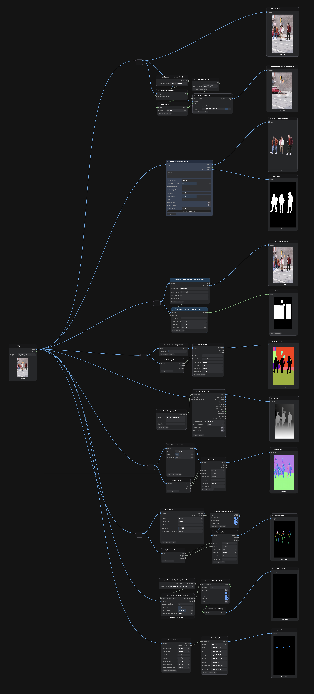
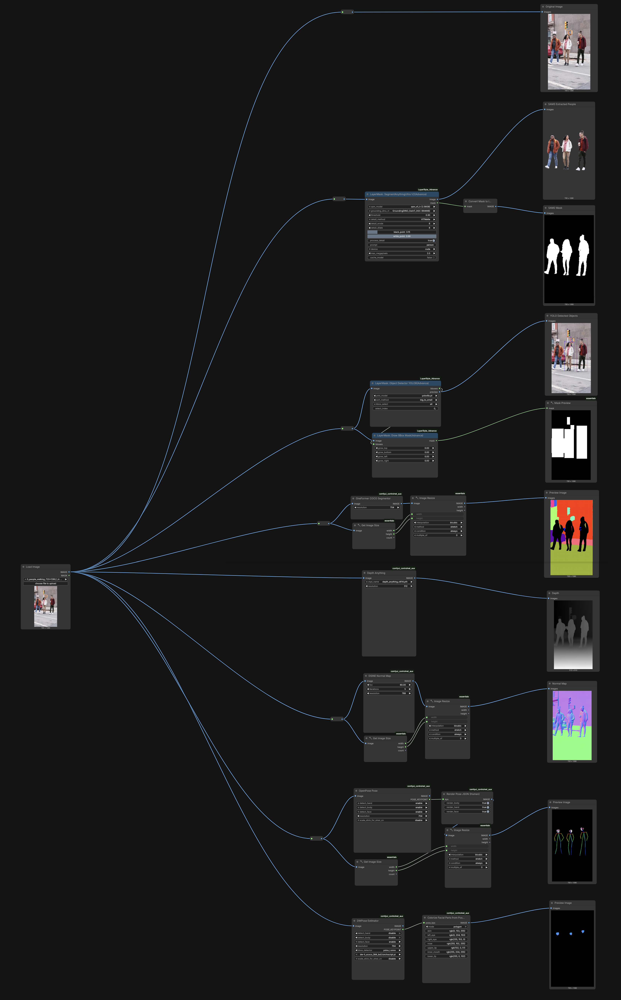

# Human_CV Workflow

 

Work products from a custom "Human_CV" workflow. It produces the following data streams, among others (clockwise from top left): 

1. Original image
2. Extracted people
3. People masks
4. Depth estimation
5. Normal estimation
6. Inpainted background
7. Subject bounding boxes and labels
8. Automatic image segmentation 
9. Body, face, and hand pose estimation
10. Face subpart masks

---

## Workflows

*There are minor differences in the nodes supported by cloud.comfy.org versus RunComfy.com.*

<table>
<tr>
<td valign="top">Workflow for cloud.comfy.org </td>
<td valign="top">Workflow for runcomfy.com</td>
</tr>
</table>