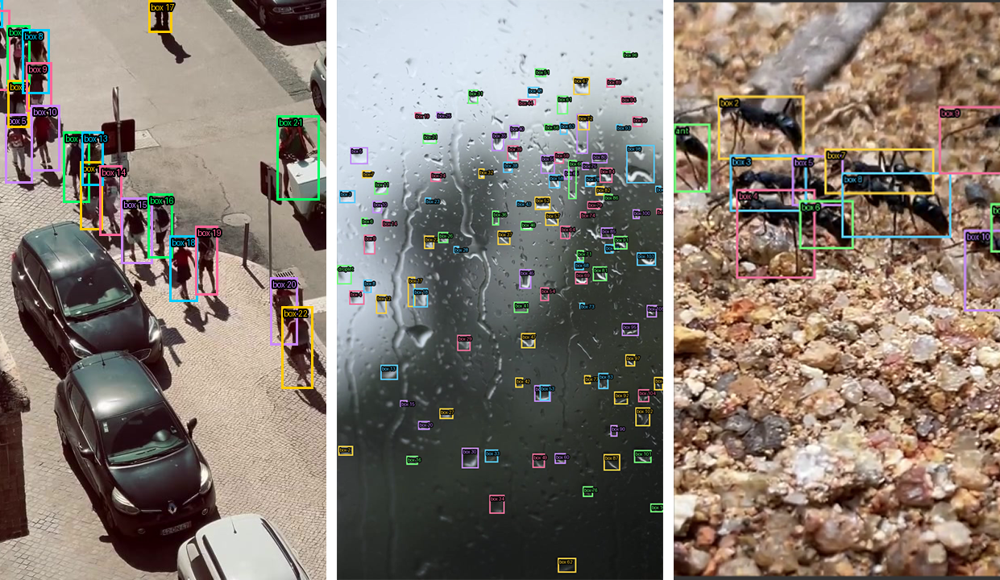
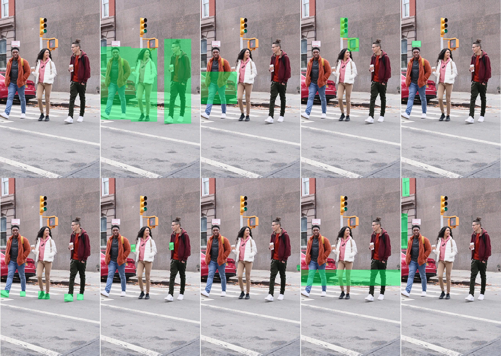

# ComfyUI-LocateAnything

<br />*LocateAnything can handle some difficult extractions, e.g.: people, water droplets, ants.*

<br />*LocateAnything findings in a single image: original image; people, cars, streetlights, streetsigns, sneakers, coffee, drainpipe, curb, windows.*

## About *LocateAnything*

This page presents a (RunComfy.com) ComfyUI workflow for nVidia's [**LocateAnything**](https://huggingface.co/nvidia/LocateAnything-3B) (2026), a vision-language model for fast and high-quality visual grounding. It enables "precise object localization, dense detection, and point-based localization across diverse domains. The model adopts a generalist design, supporting tasks such as referring expression grounding, multi-object detection, GUI element grounding, and text localization, with strong performance in complex and cluttered scenes."

* nVidia's [models, model card, and downloads](https://huggingface.co/nvidia/LocateAnything-3B)
* nVidia's [LocateAnything GitHub](https://github.com/NVlabs/Eagle/tree/main/Embodied)
* [ComfyUI-LocateAnything](https://github.com/alisson-anjos/ComfyUI-LocateAnything) ComfyUI node

---

## Installing `ComfyUI-LocateAnything` in RunComfy

*This is a step-by-step guide to getting the `ComfyUI-LocateAnything` node working on RunComfy.com, which requires a couple of extra steps. The node installs fine but may produce a runtime crash, as explained in Step 5 below, which requires a patch. The fix is to make two small edits to the model's Python source files. The 7 installation steps, described below, are:*

> 1. Install the `ComfyUI-LocateAnything` custom node
> 2. Install additional runtime dependencies 
> 3. Upload the `locate_anything_basic_workflow.json` workflow
> 4. Download the model weights
> 5. Add code patches in the RunComfy Terminal
> 6. Verify these downloads worked
> 7. Restart ComfyUI and Run the workflow

#### 1. Install the `ComfyUI-LocateAnything` custom node

* In ComfyUI Manager, search for **ComfyUI-LocateAnything** v.0.1.2 (by alisson-anjos) and install it. Restart ComfyUI after installation, and hard-refresh your browser. **Note:** *this workflow has not yet been updated to work with ComfyUI-LocateAnything versions higher than 0.1.2. When you click the "Install" button you'll be able to select the 0.1.2 version.*
* As usual, the Manager will ask you to Restart the ComfyUI server (red button) and refresh the browser; do this. 

#### 2. Install additional runtime dependencies 

* Open the RunComfy Terminal ("Terminal" button on the right side), and install the model's additional runtime dependencies: `pip install decord lmdb`

#### 3. Upload the `locate_anything_basic_workflow.json` workflow


Upload or drag either of the following workflows into ComfyUI: 

* [`locate_anything_basic_workflow.json `](workflows/locate_anything_basic_workflow.json)
* [`locate_anything_basic_workflowimg.png `](workflows/locate_anything_basic_workflowimg.png) ("workflow image")

You can upload these by going to *C->File->Open* and selecting one of these files. This will add the `LocateAnythingModelLoader` node to your workflow. 

At this point, you should also ensure that the following properties are set in the `LocateAnythingModelLoader` node as follows:

* `model_source`: `nvidia/LocateAnything-3B`
* `download_model`: `true` **(IMPORTANT)**
* `attention`: `sdpa`

#### 4. Download the model weights

**Run** the workflow once by pressing the ▶ *Run* button. Because you set `download_model`: `true`, this will download the model weights (~6GB) to:

```
/workspace/ComfyUI/models/LocateAnything/nvidia--LocateAnything-3B/
```

**Note:** this will also crash; *that's expected.* You will probably see an error like 

```
NotImplementedError: self._attn_implementation='flash_attention_2'
```

However: the model weights are now downloaded.

#### 5. Add code patches in the RunComfy Terminal 

In the RunComfy terminal, run the following commands one at a time. These will patch the Python code used in the vision system. 

```bash
wget -O /workspace/ComfyUI/models/LocateAnything/nvidia--LocateAnything-3B/modeling_locateanything.py "https://gist.githubusercontent.com/golanlevin/71f6278aa53cb9f7d757fb8487d2190e/raw/dbf36e8e3fbbe6cfdb3646d9c6142e95ebbb7031/modeling_locateanything.py"
```

```bash
wget -O /workspace/ComfyUI/models/LocateAnything/nvidia--LocateAnything-3B/modeling_qwen2.py "https://gist.githubusercontent.com/golanlevin/0cccacbdbab024da11c9a857f627495e/raw/e9c682ba70aefbac3bcd638b269634feab6cd895/modeling_qwen2.py"
```

```bash
rm -rf /root/.cache/huggingface/modules/transformers_modules/nvidia_hyphen__hyphen_LocateAnything_hyphen_3B/
```

There are additional copies of these patched files here: 

* [modeling_locateanything.py](patches/modeling_locateanything.py)
* [modeling_qwen2.py](patches/modeling_qwen2.py)

**Why these patches are necessary:**

> *The `nvidia/LocateAnything-3B` model was built to use NVIDIA's proprietary `magi_attention`
library for fast training. When `magi_attention` isn't installed (which it won't be on a
standard RunComfy instance), the code falls back to `flash_attention_2`. However, the
model's custom `Qwen2Model.forward()` forward-pass method only actually implements two attention paths — `magi` and `sdpa` — so `flash_attention_2` hits a `raise NotImplementedError`.*
>
> *The fix forces the fallback to `sdpa` (PyTorch's native scaled dot product attention)
instead, which is fully supported and works great on A6000 GPUs.*


#### 6. Verify these downloads worked

Execute this directory-listing command in the RunComfy Terminal: 

```bash
ls -la /workspace/ComfyUI/models/LocateAnything/nvidia--LocateAnything-3B/modeling*
```

The expected output is that `modeling_locateanything.py` is ~22kb, and `modeling_qwen2.py` is ~78kb. It should look something like:

```
-rw-r--r-- 1 root root 22174 Jun 30 04:07 /workspace/ComfyUI/models/LocateAnything/nvidia--LocateAnything-3B/modeling_locateanything.py
-rw-r--r-- 1 root root 78205 Jun 30 04:08 /workspace/ComfyUI/models/LocateAnything/nvidia--LocateAnything-3B/modeling_qwen2.py
```

#### 7. Restart ComfyUI and Run the workflow

Restart ComfyUI and refresh your browser (as usual). Now, be sure to your workflow with:

- `attention`: `sdpa`
- `download_model`: `false` (because the weights are already downloaded and patched!)

The model should load and run without errors.

#### Installation Notes

* These edits need to be re-applied if the model is re-downloaded from scratch
  (the weights persist but the source files can be overwritten).
* The `rm -rf` cache clear is required after editing the source files, otherwise
  the old cached version continues to be used.
* The `wget` approach is necessary on RunComfy because `python3` is not in the
  allowed terminal commands.


---

## Appendix: GitHub Gists used in the Code Patches

*The following GitHub Gists are used in Step 5, "Add code patches in the RunComfy Terminal":*

#### golanlevin/modeling_locateanything.py

* <https://gist.github.com/golanlevin/71f6278aa53cb9f7d757fb8487d2190e>
* https://gist.githubusercontent.com/golanlevin/71f6278aa53cb9f7d757fb8487d2190e/raw/dbf36e8e3fbbe6cfdb3646d9c6142e95ebbb7031/modeling_locateanything.py
* `wget -O /workspace/ComfyUI/models/LocateAnything/nvidia--LocateAnything-3B/modeling_locateanything.py "https://gist.githubusercontent.com/golanlevin/71f6278aa53cb9f7d757fb8487d2190e/raw/dbf36e8e3fbbe6cfdb3646d9c6142e95ebbb7031/modeling_locateanything.py"`

#### golanlevin/modeling_qwen2.py: 

* <https://gist.github.com/golanlevin/0cccacbdbab024da11c9a857f627495e>
* https://gist.githubusercontent.com/golanlevin/0cccacbdbab024da11c9a857f627495e/raw/e9c682ba70aefbac3bcd638b269634feab6cd895/modeling_qwen2.py
* `wget -O /workspace/ComfyUI/models/LocateAnything/nvidia--LocateAnything-3B/modeling_qwen2.py "https://gist.githubusercontent.com/golanlevin/0cccacbdbab024da11c9a857f627495e/raw/e9c682ba70aefbac3bcd638b269634feab6cd895/modeling_qwen2.py"`

### Recreating these Patches from Scratch

*These patches are stored and served as GitHib Gists. If you wish to modify or recreate the two Python patches, you will need to have a GitHub account.*

#### A-1. Download the original source files to your computer

In your browser, download these two files directly:

- `https://huggingface.co/nvidia/LocateAnything-3B/resolve/main/modeling_locateanything.py`
- `https://huggingface.co/nvidia/LocateAnything-3B/resolve/main/modeling_qwen2.py`

#### A-2. Edit `modeling_locateanything.py`

Open `modeling_locateanything.py` in a text editor and make the following changes.

In `modeling_locateanything.py`, find this block (around line 116, inside `LocateAnythingForConditionalGeneration.__init__`):

```python
text_attn_impl = (
    getattr(config.text_config, '_attn_implementation', None)
    or getattr(config, '_attn_implementation', None)
    or 'magi'
)
```

Change `'magi'` to `'sdpa'`:

```python
text_attn_impl = (
    getattr(config.text_config, '_attn_implementation', None)
    or getattr(config, '_attn_implementation', None)
    or 'sdpa'
)
```

Save the `modeling_locateanything.py` file.

#### A-3. Edit `modeling_qwen2.py`

Find this block (inside `Qwen2DecoderLayer.__init__`):

```python
        if config._attn_implementation == 'magi' and not _MAGI_AVAILABLE:
            if is_flash_attn_2_available():
                logger.warning_once(
                    'magi_attention not available, falling back to flash_attention_2'
                )
                config._attn_implementation = 'flash_attention_2'
            else:
                logger.warning_once(
                    'magi_attention not available, falling back to sdpa'
                )
                config._attn_implementation = 'sdpa'
```

Replace the entire block with this (indentation matters — use spaces, not tabs):

```python
        if config._attn_implementation == 'magi' and not _MAGI_AVAILABLE:
            logger.warning_once(
                'magi_attention not available, falling back to sdpa'
            )
            config._attn_implementation = 'sdpa'
```

Save the `modeling_qwen2.py` file.

#### A-4. Upload the two files to GitHub Gists

1. Go to [gist.github.com](https://gist.github.com)
2. Create a **public** gist for `modeling_locateanything.py`. 
3. Paste in the full edited file content.
4. After saving, click the **Raw** button and save that URL somewhere; youll need it.
5. Repeat this procedure for `modeling_qwen2.py`

Your raw URLs will look like:
```
https://gist.githubusercontent.com/YOUR-USERNAME/GIST-ID/raw/modeling_locateanything.py
https://gist.githubusercontent.com/YOUR-USERNAME/GIST-ID/raw/modeling_qwen2.py
```

#### A-5. Modify the `wget` commands in *5. Add code patches in the RunComfy Terminal*

In Step 5 of the RunComfy installation procedure, above, modify the `wget` commands so that they include the Raw URLs of your modified Python files, as follows: 

```bash
wget -O /workspace/ComfyUI/models/LocateAnything/nvidia--LocateAnything-3B/modeling_locateanything.py "YOUR_GIST_RAW_URL_FOR_LOCATEANYTHING"
```

```bash
wget -O /workspace/ComfyUI/models/LocateAnything/nvidia--LocateAnything-3B/modeling_qwen2.py "YOUR_GIST_RAW_URL_FOR_QWEN2"
```

---