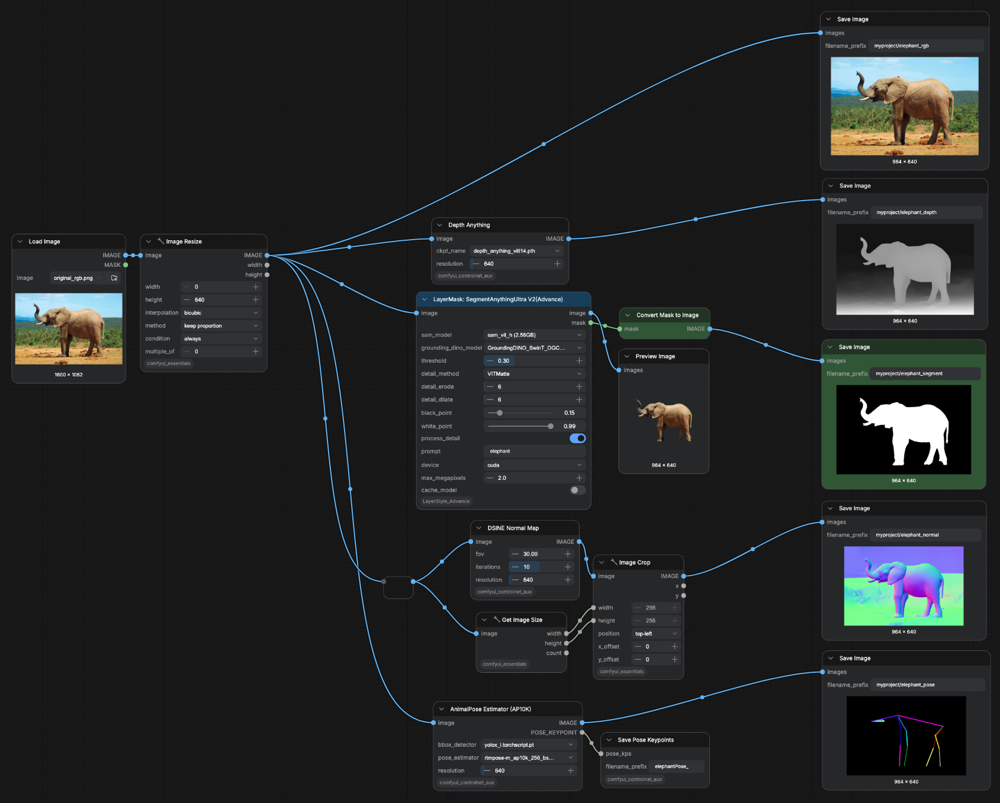
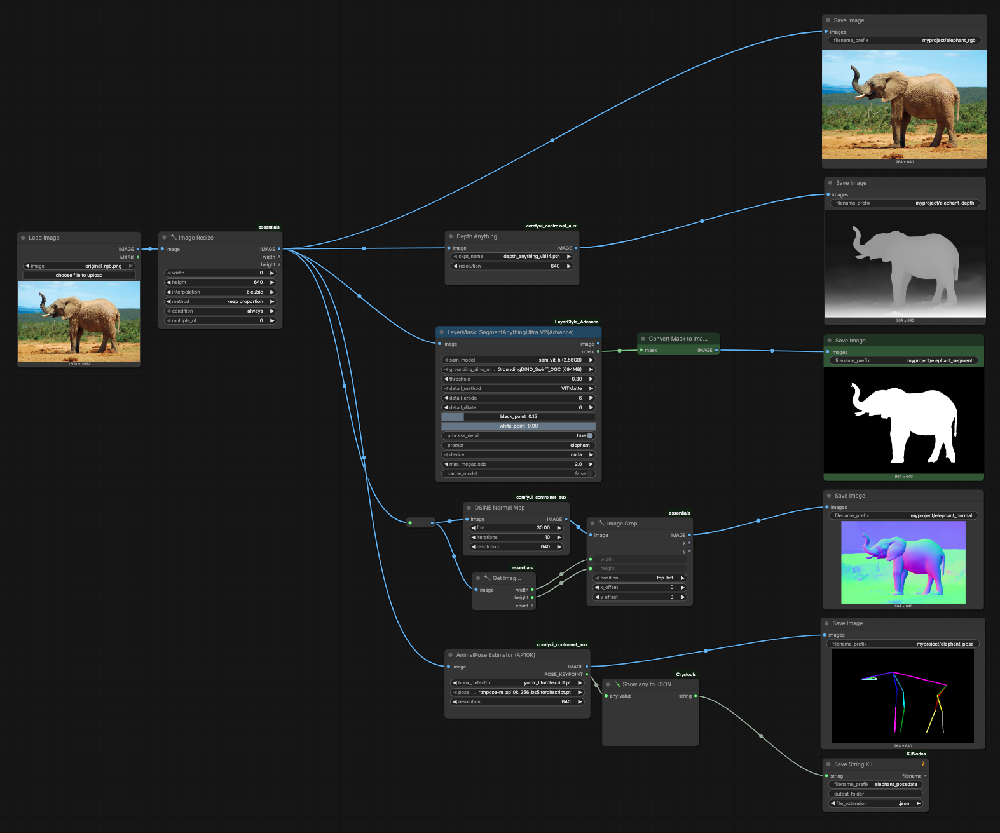

# Quadruped_CV Workflow

 

Work products from a custom "Quadruped_CV" workflow. It produces the following data streams: 

1. [Original image](elephant.png)
2. Depth estimation
3. Animal body mask
4. Normal-map estimation
5. Quadruped pose estimation

---

## Workflows

*There are minor differences in the nodes supported by cloud.comfy.org versus RunComfy.com.*

<table>
<tr>
<td valign="top">Workflow for cloud.comfy.org </td>
<td valign="top">Workflow for runcomfy.com</td>
</tr>
</table>