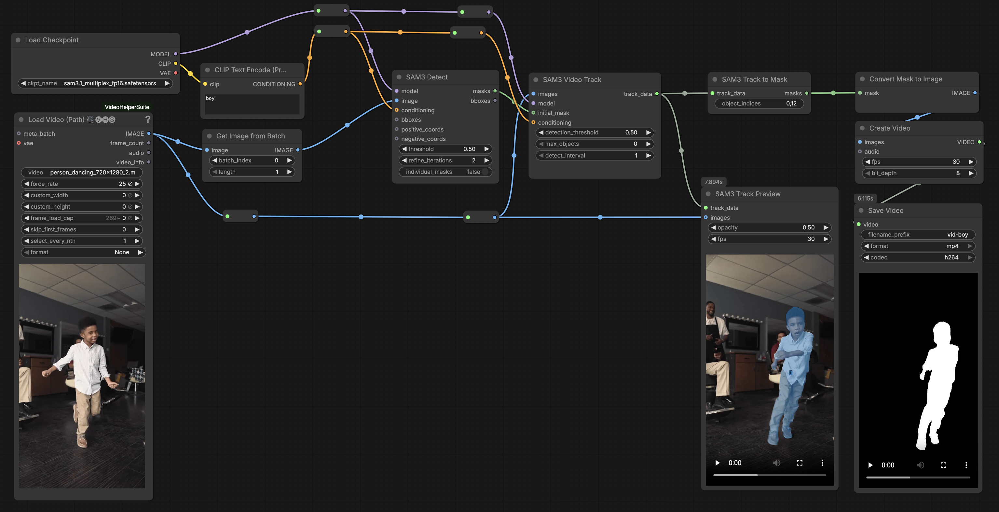
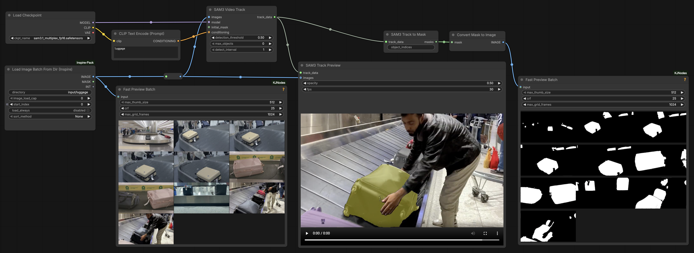

# Segment Anything

 
*A collection of SAM3 segmentations (L-R): original image; SAM3 prompted with "dog", "ground", "grass", "trees", "person", "leash".*

## About *Segment Anything*

This page presents (RunComfy.com) ComfyUI workflows for Meta's **Segment Anything 3.1** (SAM 3.1), a model for promptable image and video segmentation. Whereas *LocateAnything* answers *"Where is the object?"* with bounding boxes, SAM answers "Which pixels belong to the object?" with detailed segmentation shape masks.

SAM 3 accepts text prompts as well as points, bounding boxes, masks, and image exemplars, allowing it to detect, segment, and track every instance of an open-vocabulary concept. The model can produce accurate pixel-level masks for objects specified by natural language (such as "orange traffic cone" or "striped umbrella"), making it useful for object extraction, image annotation, visual analysis, and downstream computer-vision workflows. This workflow typically converts text prompts into precise object masks that can be measured, visualized, or passed to subsequent image-processing stages.

* Meta's SAM 3 [main landing page](https://ai.meta.com/research/sam3/) and [YouTube intro](https://www.youtube.com/watch?v=G4OLPDjwncw)
* Meta's SAM 3 [interactive demo online](https://aidemos.meta.com/segment-anything)
* Meta's SAM 3 [GitHub repository](https://github.com/facebookresearch/sam3)
* Huggingface SAM 3.1 [models and downloads](https://huggingface.co/facebook/sam3.1)

---

## Segment Anything: Image Workflow

* [sam3.1_image_workflow.json](workflows/sam3.1_image_workflow/sam3.1_image_workflow.json) (workflow)
* [sam3.1_image_workflowimg.png](workflows/sam3.1_image_workflow/sam3.1_image_workflowimg.png) ("workflow image")
* [sample image](workflows/sam3.1_image_workflow/person_walking_dog_720x1280_1_2.jpg) (person walking dog, 168kb)

This is a simplified workflow that uses the *Image Segmentation (SAM3)* node, often [used for image inpainting](https://www.runcomfy.com/comfyui-workflows/void-video-inpainting-comfyui-temporal-object-clean-up-workflow).

---

## Segment Anything: Video Workflow

* [sam3.1_video_workflow.json](workflows/sam3.1_video_workflow/sam3.1_video_workflow.json) (workflow)
* [sam3.1_video_workflowimg.png](workflows/sam3.1_video_workflow/sam3.1_video_workflowimg.png) ("workflow image")
* [Test footage](workflows/sam3.1_video_workflow/person_dancing_720x1280_2.mp4) (person dancing, 2.5MB)

This workflow uses the following nodes: 

* [**SAM3_Detect**](https://docs.comfy.org/built-in-nodes/SAM3_Detect): Performs detection and segmentation using text descriptions, bounding boxes, or point prompts.
* [**SAM3_VideoTrack**](https://docs.comfy.org/built-in-nodes/SAM3_VideoTrack): Tracks objects across video frames, maintaining object identities, using either initial masks or text prompts to define what to track.
* [**SAM3_TrackToMask**](https://docs.comfy.org/built-in-nodes/SAM3_TrackToMask): Selects specific tracked objects from a SAM3 tracking session by their index numbers and combines them into a single output mask. If `object_indices` is left empty, all tracked objects are included.

---

## Segment Anything: Image Batch Workflow

* [sam3.1_imagebatch_workflow.json](workflows/sam3.1_imagebatch_workflow/sam3.1_imagebatch_workflow.json) (workflow)
* [sam3.1_imagebatch_workflowimg.png](workflows/sam3.1_imagebatch_workflow/sam3.1_imagebatch_workflowimg.png) ("workflow image")
* [sample input](workflows/sam3.1_imagebatch_workflow/luggage/) (set of luggage carousel photos)

Note that when processing a batch of images, the images must all be *regularized* so as to have the same dimensions, orientation, number of channels, and bit depth (e.g. 8-bit RGB). If your images have diverse dimensions, you can regularize them by interposing a ComfyUI node for scaling/cropping/letterboxing, or by processing them beforehand with an `ffmpeg` script. 

