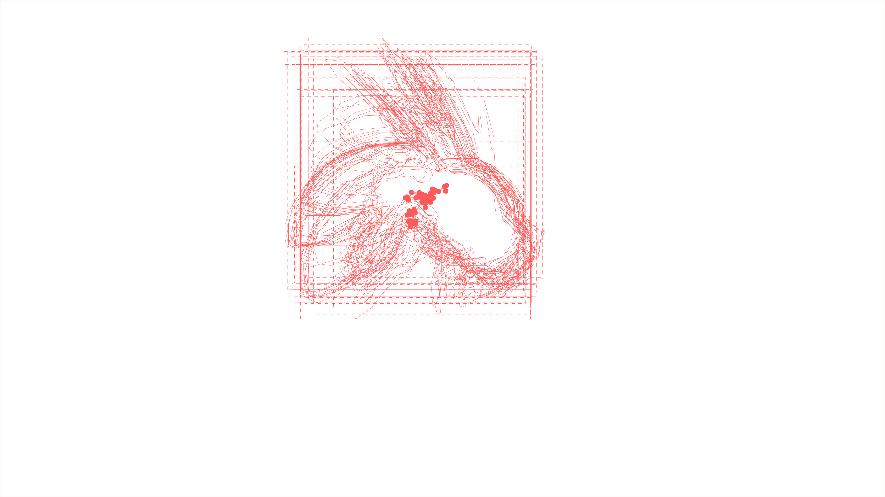

# Segment-Anything to Contours


This workflow expands [Segment Anything](../segment_anything/README.md) with custom nodes that allow you to export sequences of **vector-based contours of tracked objects**. The workflow is provided here: 

* [sam3_with_tracks_export_workflow.json](workflow/sam3_with_tracks_export_workflow.json) (workflow)
* [sam3_with_tracks_export_workflowimg.png](workflow/sam3_with_tracks_export_workflowimg.png) ("workflow image")
* [bee.mp4]() (sample media, 770kb)

[](workflow/sam3_with_tracks_export_workflowimg.png)

This workflow requires the **SFCI_ComfyUI_EasyVision**
custom ComfyUI nodes, created by CMU student Claire Vlases at the STUDIO for Creative Inquiry (SFCI): [SAM3TrackToTracks](https://github.com/CreativeInquiry/SFCI_ComfyUI_EasyVision/blob/main/nodes.py#L120), [EasyTracksExport](https://github.com/CreativeInquiry/SFCI_ComfyUI_EasyVision/blob/main/nodes.py#L898), and [EasyTracksPreview](https://github.com/CreativeInquiry/SFCI_ComfyUI_EasyVision/blob/main/nodes.py#L1137).


---

## Installation

### 1. Enable Node Installation by Git URL

In order to use the special **SFCI_ComfyUI_EasyVision** nodes, we need to allow ComfyUI to install nodes using Github URLs. In RunComfy, **open** the file `config.ini` for editing. You can find this file by searching for `config.ini` in the Assets file browser, or navigate to: 

```
🏠/ComfyUI/custom_nodes/ComfyUI-Manager/config.ini`
```

In this file, **add** the line (or **set** the property): 

```
allow_git_url_install = True
```

Click the floppy disk icon to **save** the change. Then use the top-bar button to **Restart ComfyUI** (since this config file is read once at startup), and hard-refresh your browser.

### 2. Install Nodes via Git URL

It should now be possible to intall the nodes by navigating: *Manager -> Install via Git URL*. **Paste** in the URL, 

[`https://github.com/CreativeInquiry/SFCI_ComfyUI_EasyVision`](https://github.com/CreativeInquiry/SFCI_ComfyUI_EasyVision)

As usual, **restart** the ComfyUI server and **refresh** the browser page. 

### 3. Fallback: Direct Upload

If for some reason *Install via Git URL* does not work, you can instead do the following: 

* **Download** and **unzip** this archive: [`SFCI_ComfyUI_EasyVision.zip`](workflow/SFCI_ComfyUI_EasyVision.zip) (140kb)
* **Navigate** to `🏠/ComfyUI/custom_nodes/`
* **Click** the vertical dots `⋮` and **choose** *Upload*
* **Upload** the unzipped folder
* **Restart** the ComfyUI server and **refresh** the browser page. 

---




