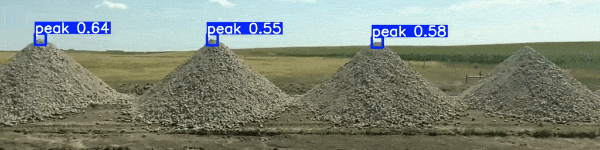
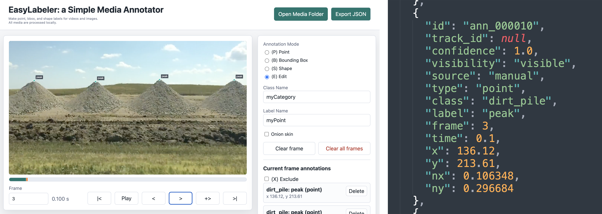
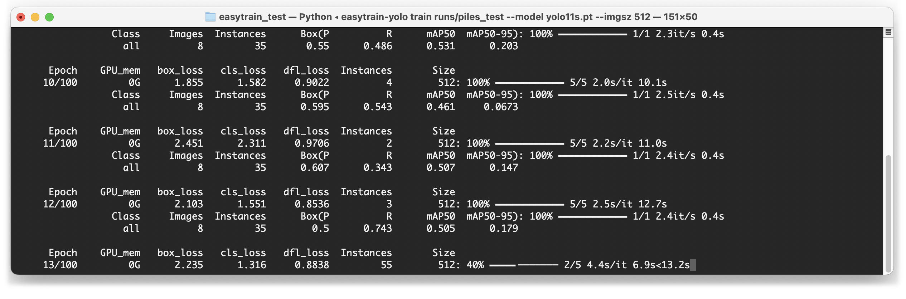
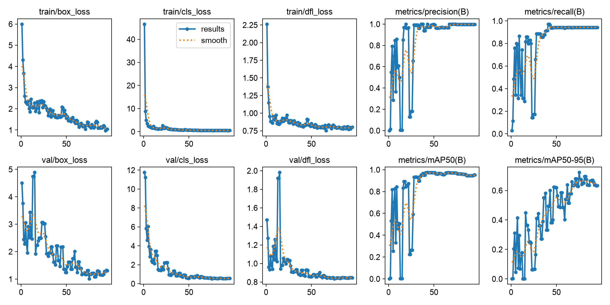
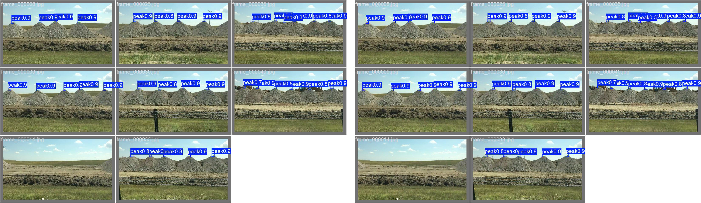
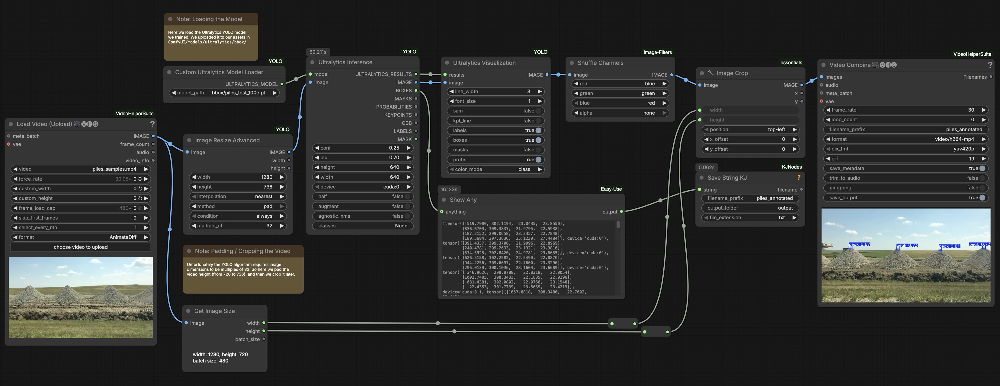
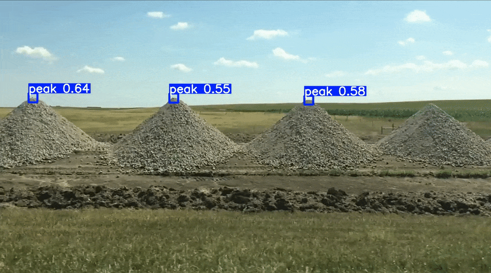
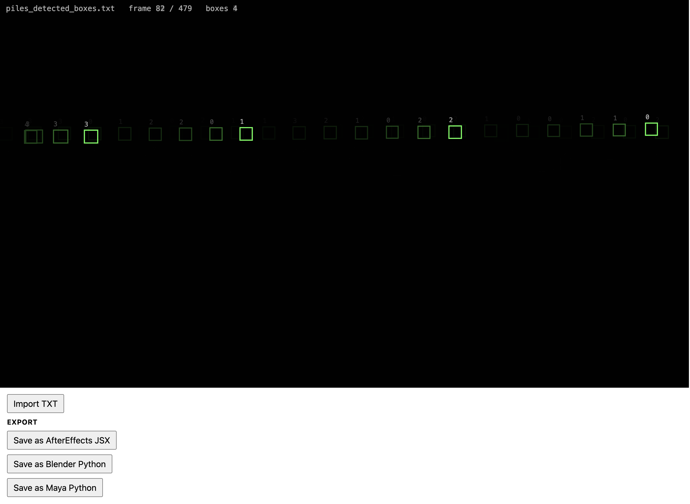
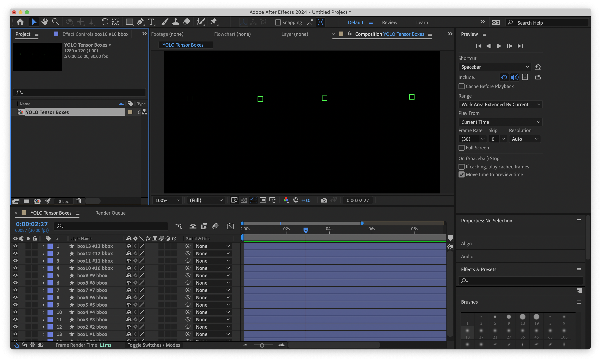

# easytrain-yolo

*A command-line tool to train lightweight detectors for custom phenomena*



---

## Overview 

[**YOLO** (You Only Look Once)](https://en.wikipedia.org/wiki/You_Only_Look_Once) is a family of computer vision models for recognizing and locating objects in images and video. Because YOLO models can be fine-tuned from a pretrained network, they are well suited to creative applications where as few as 50–200 carefully labeled examples can be enough to build a reliable detector for a custom phenomenon.

`easytrain-yolo` is a local command-line tool that trains a YOLO detector from [EasyLabeler](https://github.com/CreativeInquiry/ComfyCV/tree/main/easylabeler) annotations. It converts EasyLabeler JSON annotations into an Ultralytics YOLO dataset; trains a model; and then packages the resulting `.pt` model for ComfyUI-YOLO. You can then use this model in ComfyUI. Note that training is performed *locally* on your own computer, so some installation is required.

How does it work? Rather than training a neural network from scratch, `easytrain-yolo` starts with a pretrained YOLO model that has already learned general visual features from millions of labeled images. Your annotations then fine-tune this existing model so that it learns to recognize the specific objects or visual phenomena you care about.


### TL;DR: Main Steps / Quickstart

1. [**Install**](#3-how-to-install-easytrain-yolo-on-a-mac) `easytrain-yolo` by creating a Python venv with the libraries in [pyproject.toml](pyproject.toml).
2. **Label** your media with [EasyLabeler](https://github.com/CreativeInquiry/ComfyCV/tree/main/easylabeler). Export the JSON annotations, and keep them with the original video or image folder.
3. [**Convert**](#5-2-convert) the EasyLabeler annotations into a YOLO dataset, with the command `easytrain-yolo convert my_project/my_project_annotations.json`. By default, this creates `runs/my_project/`, using the media name from the EasyLabeler JSON.
4. [**Train**](#5-4-train) the model: `easytrain-yolo train runs/my_project`. (Optional quality check: preview before training with the `preview` option.) You should now have a `.pt` model, with a name similar to `runs/my_project/exported_model/my_project_YYYYMMDDHHMM_yolo_model_100e.pt`. 
5. [**Upload**](#6-use-your-model-in-comfyui) the model into ComfyUI and use it with the [ComfyUI Ultralytics YOLO](https://www.runcomfy.com/comfyui-nodes/comfyui-ultralytics-yolo) detection node.


### Contents

1. [Inputs: What `easytrain-yolo` Needs](#1-inputs-what-easytrain-yolo-needs)
2. [Outputs: What `easytrain-yolo` Produces](#2-outputs-what-easytrain-yolo-produces)
3. [How to Install `easytrain-yolo` on a Mac](#3-how-to-install-easytrain-yolo-on-a-mac)
4. [Run a Quick Test](#4-run-a-quick-test)
5. [Train Your Own Model](#5-train-your-own-model)
6. [Use Your Model In ComfyUI](#6-use-your-model-in-comfyui)
7. [Use Your Exported Data](#7-use-your-exported-data)
8. Appendices
  * [**Command Reference**](#command-reference)
  * [How Many Labels Do I Need?](#how-many-labels-do-i-need)
  * [Annotation Behavior](#annotation-behavior)
  * [Troubleshooting](#troubleshooting)
  * [Limitations](#limitations)


---

## 1. Inputs: What `easytrain-yolo` Needs

`easytrain-yolo` consumes data that you have labeled with [EasyLabeler](../easylabeler/README.md). The `easytrain-yolo` tool expects you to provide a pair of things:

1. The exported EasyLabeler `.json` annotation file.
2. The original video or image folder that you annotated.

An example of these can be found in [`examples/piles_test/`](examples/piles_test). In this example, as shown below, a series of dirt piles have been annotated; the top of each dirt pile is labeled with a point called "peak" (a label that I defined). Our aim is to train a model which will be able to automatically detect and locate these peak-points:

1. [`piles_test_annotations.json`](examples/piles_test/piles_test_annotations.json)
2. [`piles_test.mp4`](examples/piles_test/piles_test.mp4) (2MB)



For a video project, organize your inputs like so:

```text
my_project/
  my_project_annotations.json
  my_project.mp4
```

For an image-folder project, organize your inputs like so:

```text
my_project/
  my_project_annotations.json
  images/
    img_001.jpg
    img_002.jpg
    img_003.jpg
```

For `easytrain-yolo`, the EasyLabeler `label` field (such as "peak", in the example shown here) becomes the YOLO "class" name by default.


---

## 2. Outputs: What `easytrain-yolo` Produces

Using `easytrain-yolo` has two main steps, with different products: 

1. **conversion** turns the EasyLabeler inputs into a YOLO dataset, 
2. **training** creates a trained PyTorch (`.pt`) model file

When you run `easytrain-yolo convert`, it creates an output project folder. By default, this folder is named from the original media file in the EasyLabeler JSON. For example, `my_project.mp4` becomes:

```text
runs/my_project/
```

If the JSON file does not contain `metadata.source_filename`, `easytrain-yolo` falls back to the annotation filename, stripping common suffixes like `_annotations` or `_labels`. For example, `my_project_annotations.json` also becomes `runs/my_project/`.

In these instructions, output folders are placed inside `runs/` by default; this is a common name for folders in which to put results. You could use another output folder, such as `custom_output/` or `experiments/my_project/`, as long as you use the same folder again when you run `easytrain-yolo train`.

After conversion and training, that folder will contain the main files students normally need:

```text
runs/my_project/
  dataset/
    data.yaml
    images/
    labels/
  previews/
  conversion_report.json
  training/
    args.yaml
    results.csv
    results.png
    val_batch0_ground_truth.jpg
    val_batch0_predictions.jpg
    weights/
      best.pt
      last.pt
  exported_model/
    my_project_YYYYMMDDHHMM_yolo_model_100e.pt
    my_project_YYYYMMDDHHMM_yolo_training_report.txt
  README_FOR_COMFYUI_YOLO.md
```

The **most important output file** is the renamed `.pt` model in `exported_model/`. **That's the file you want!** For example:

```text
runs/my_project/exported_model/my_project_202606241944_yolo_model_100e.pt
```

The timestamp and epoch count (`100e`) in its name make it easier to remember when and how long the model was trained. Its sibling `.txt` report includes more detailed training settings and validation metrics.

#### Additional (Verbose) Outputs

By default, `easytrain-yolo` removes extra Ultralytics diagnostic images after training so the output folder is easier to read.

If you train with the `-v` or `--verbose` flag in your training command, then extra diagnostic files are kept as well. In that case, `runs/my_project/training/` may also include additional files such as:

```text
runs/my_project/training/
  BoxF1_curve.png
  BoxP_curve.png
  BoxPR_curve.png
  BoxR_curve.png
  confusion_matrix.png
  confusion_matrix_normalized.png
  labels.jpg
  train_batch0.jpg
  train_batch1.jpg
  train_batch2.jpg
  train_batch*.jpg
```

Those verbose files can be useful for advanced debugging, but most students should start with the shorter default output.


---

## 3. How to Install `easytrain-yolo` on a Mac

Training a YOLO model requires significant memory and processing resources. The process currently depends on the PyTorch and Ultralytics Python ecosystem. For this reason — although trained YOLO models can later be exported to formats such as ONNX for fast web deployment and inference — the training itself still requires a local Python installation.

You are strongly advised to create or use a *Python virtual environment*. A virtual environment is a local Python installation, just for this one project. It keeps `easytrain-yolo` and its machine-learning libraries separate from the rest of your computer. This is useful because it can prevent your installation from causing accidental conflicts.

As of mid-2026, Python 3.10 or 3.11 is recommended for this project, though 3.14 seems to be working as well. The examples below use Python 3.11.

**Open** the Terminal app and **go** to the `easytrain-yolo` project folder:

```bash
cd /path/to/easytrain-yolo
```

**Create** a virtual environment named `.venv`:

```bash
python3.11 -m venv .venv
```

If that command says `python3.11` was not found, try:

```bash
python3.10 -m venv .venv
```

**Activate** the virtual environment:

```bash
source .venv/bin/activate
```

After activation, your Terminal prompt should begin with `(.venv)`. That means you are correctly using the project environment.

**Update** `pip`, Python's package installer:

```bash
python -m pip install --upgrade pip
```

**Install** `easytrain-yolo` and its required libraries:

```bash
python -m pip install -e .
```

The final `.` means "install the project in the current folder." During this step, `pip` reads a special file called [`pyproject.toml`](pyproject.toml). That file tells Python which libraries to install, and how to create the `easytrain-yolo` command.

**Check** that the command works:

```bash
easytrain-yolo --help
```

Each time you open a new Terminal window to use this project, you'll need to return to the project folder and activate the environment again:

```bash
cd /path/to/easytrain-yolo
source .venv/bin/activate
```

If neither `python3.11` nor `python3.10` works, install Python 3.11 from <https://www.python.org/downloads/> and then repeat these steps. Very new Python versions may work, but Python 3.10 or 3.11 is currently the safer classroom choice for machine-learning libraries.


---

## 4. Run a Quick Test

This repository includes a small labeled video in `piles_test/`. Use it to make sure the tool works before training your own model.

**Activate** the virtual environment, if you have not already done so:

```
source .venv/bin/activate
```

**Inspect** the labels:

```bash
easytrain-yolo inspect examples/piles_test/piles_test_annotations.json
```

**Convert** the labels into a YOLO dataset and make preview images:

```bash
easytrain-yolo convert examples/piles_test/piles_test_annotations.json
```

This generates:

```text
runs/piles_test/
  dataset/
    data.yaml
    images/train/
    images/val/
    labels/train/
    labels/val/
  previews/train/
  conversion_report.json
```

At this point, the model has still not been trained yet. These files are the converted dataset and preview images made from your own labels.

We should **check** that the green boxes appear around the labeled peaks. A few `Clamped point box` warnings are normal when a point is close to the edge of the video frame. To do this check, **open**:

```text
runs/piles_test/previews/train/
```

**Run** a short training "smoke test" (a quick test to make sure things are working properly). **Note** that `epochs` is set to **1**, meaning that this is only going to run for one round of training. A one-epoch model is only a *test* that the pipeline works — it is not a useful detector!

```bash
easytrain-yolo train runs/piles_test \
  --model yolo11n.pt \
  --epochs 1 \
  --imgsz 320 \
  --batch 4
```

This should generate:

```text
runs/piles_test/exported_model/piles_test_YYYYMMDDHHMM_yolo_model_1e.pt
```


---

## 5. Train Your Own Model

*Use this workflow to train a YOLO model from your own EasyLabeler annotations.*

**Activate** the virtual environment, if you have not already done so:

```
source .venv/bin/activate
```

### 5.1. Inspect

```bash
easytrain-yolo inspect path/to/your_annotations.json --class-field label
```

This prints a summary of the labels, annotation types, classes, and labeled frames/images.

### 5.2. Convert

```bash
easytrain-yolo convert path/to/your_annotations.json
```

By default, conversion creates `runs/<source-media-name>/`, makes up to 24 preview images, and replaces any previous converted dataset in the same output folder.

If the original video or image folder is not beside the annotation JSON, add `--media-root path/to/media`. If you want a different output folder, add `--out runs/my_project`. Other options are documented in the [Command Reference](#command-reference).

### 5.3. Preview

Always inspect the converted labels before training:

```bash
easytrain-yolo preview runs/my_project --count 24
```

Open:

```text
runs/my_project/previews/train/
```

If the boxes are in the wrong place, stop and fix the labels or media path before training.

### 5.4. Train

Start with the default ("nano") YOLO model:

```bash
easytrain-yolo train runs/my_project
```

This command uses the standard defaults documented in the [Command Reference](#command-reference): the "nano" `yolo11n.pt` base model, 100 epochs, image size 640, batch size 8, and workers 0. Here's a screenshot of training in progress:



On an M1 Mac, the included `piles_test` example took about 13 minutes for 100 epochs with these settings. Your dataset may be faster or slower.

After training, the main files to inspect are:

```text
runs/my_project/training/results.png
runs/my_project/training/val_batch0_ground_truth.jpg
runs/my_project/training/val_batch0_predictions.jpg
```



* `results.png`: a chart of the training run (example shown above). It shows losses and validation metrics over time. In general, training losses should trend downward, while precision, recall, and mAP should trend upward. Do not worry about small wiggles, especially with tiny validation sets.
* `val_batch0_ground_truth.jpg` displays the annotations you made with EasyLabeler. 
* `val_batch0_predictions.jpg` shows the trained model's predictions on those same validation images.

The image below shows the `ground_truth` annotations (at left) compared with the `predictions` for the same images in that validation set.



By default, extra Ultralytics diagnostic images are deleted to keep the folder readable. To keep every diagnostic file, add `-v`:

```bash
easytrain-yolo train runs/my_project -v
```

The packaged model is written to:

```text
runs/my_project/exported_model/my_project_YYYYMMDDHHMM_yolo_model_100e.pt
```

A training report is written next to it:

```text
runs/my_project/exported_model/my_project_YYYYMMDDHHMM_yolo_training_report.txt
```


---

## 6. Use Your Model In ComfyUI



Let's assume you have finished training your custom Ultralytics YOLO model using `easytrain-yolo`. Your model is intended to be used with the [comfyui-ultralytics-yolo](https://www.runcomfy.com/comfyui-nodes/comfyui-ultralytics-yolo) node, [published by shadowcz007](https://github.com/shadowcz007/comfyui-ultralytics-yolo). Here is a ComfyUI workflow for RunComfy.com that demonstrates the end-to-end use of this node with a custom-trained `easytrain-yolo` model: 

* [easytrain-yolo_inference_workflow_for_runcomfy.json](comfy_workflows/easytrain-yolo_inference_workflow_for_runcomfy.json) — a ComfyUI workflow JSON
* [easytrain-yolo_inference_workflow_for_runcomfy.png](comfy_workflows/easytrain-yolo_inference_workflow_for_runcomfy.png) — a "workflow image" (also shown above) with the JSON embedded in its metadata. 

Install the [comfyui-ultralytics-yolo](https://www.runcomfy.com/comfyui-nodes/comfyui-ultralytics-yolo) node in ComfyUI first. The usual method for doing so is to go to your ComfyUI Manager; search for `comfyui-ultralytics-yolo`; install it; then restart ComfyUI, and refresh your browser. Next, upload your model file, e.g.,

```text
runs/my_project/exported_model/my_project_YYYYMMDDHHMM_yolo_model_100e.pt
```

...into your ComfyUI Ultralytics model folder, which is usually located in your ComfyUI installation's assets at the location below:

```text
ComfyUI/models/ultralytics/bbox/
```

(Be sure not to upload your one-epoch quick test model.) Note that `easytrain-yolo` currently only supports `bbox` (bounding box) training and inference, and does not yet support `seg` (shape segmentation). Restart ComfyUI again, so that your file upload is detected; then use an Ultralytics YOLO detection node and select your uploaded `.pt` file.

The following GIF, excerpted from the video output of the above workflow, shows an example of the detected peaks. The occasional false positive, and the occasional missed peak, show that improvements can be made both to the training data and to the training process. 




---

## 7. Use Your Exported Data

The ComfyUI workflow shown here can export text-format numeric data containing the tracked points detected by the comfyui-ultralytics-yolo operators. (This happens in the `Save String KJ` node.) You can then: 

* **visualize** this data in the included p5.js viewer, [p5_easytrain_yolo_viewer](p5_easytrain_yolo_viewer/sketch.js), as shown below;
* **export** this data for AfterEffects, Blender, or Maya using [p5_easytrain_yolo_viewer](p5_easytrain_yolo_viewer/sketch.js)



For example, in After Effects, you can then *File > Script > Run File...* to load these data points into the Adobe system. You could use the exported boxes as motion-tracked guide layers: attach graphics, callouts, particles, or masks to the detected positions over time. They could also drive automated overlays, highlight detected objects, or become reference paths for compositing, stabilization, or visual debugging of the detection model.




---

# Appendices


## Command Reference


### `inspect` labels:

Prints a summary of the EasyLabeler file before creating a dataset.

```bash
easytrain-yolo inspect labels.json --class-field label
```

### `convert` labels:

Creates the YOLO dataset folders, label files, and preview images from the EasyLabeler export.

```bash
easytrain-yolo convert labels.json \
  --out runs/my_project \
  --media-root path/to/media \
  --class-field label \
  --point-box-size-px 32
```

Common `convert` options:

* `labels.json`: The EasyLabeler annotation JSON file. This is the only required argument.
* `--out runs/my_project`: The output project folder. If omitted, `easytrain-yolo` uses `runs/<source-media-name>/`, based on EasyLabeler's `metadata.source_filename`. If that metadata is missing, it falls back to the annotation filename, stripping common suffixes like `_annotations` or `_labels`.
* `--media-root path/to/media`: The folder containing the original video or images. If omitted, `easytrain-yolo` first looks near the annotation JSON file.
* `--class-field label`: Which EasyLabeler field becomes the YOLO class name. The default is `label`, which is the course convention.
* `--point-box-size-px 32`: The size of the synthetic box created around point annotations. Use a larger value, such as `40` or `48`, if the visual target is larger.
* `--preview-count 24`: Number of preview images to create after conversion. The default is 24. Use `--preview-count 0` to skip previews.
* `--val-ratio 0.2`: Fraction of frames/images reserved for validation. The default is 20%.
* `--overwrite`: Replace any previous converted dataset in the output folder. This is the default.
* `--no-overwrite`: Do not replace an existing converted dataset.

### `preview` converted boxes:

Re-renders preview images from an already converted project so you can check label placement.

```bash
easytrain-yolo preview runs/my_project --count 24
```

### `train` a model:

Trains YOLO on the converted dataset and exports the final `.pt` model plus a text report.

```bash
easytrain-yolo train runs/my_project
```

Common `train` options:

* `runs/my_project`: The converted project folder created by `easytrain-yolo convert`.
* `--model yolo11n.pt`: The starter YOLO model. The default is the 6MB "nano" model, [`yolo11n.pt`](yolo11n.pt). For greater accuracy, you can try the 19MB "small" model, [`yolo11s.pt`](yolo11s.pt), also in this directory. Larger YOLO11 models can be downloaded from <https://docs.ultralytics.com/models/yolo11>.
* `--epochs 100`: Number of training passes through the dataset. The default is 100. More epochs can improve learning, but take longer and may overfit small datasets. A one-epoch run is only a smoke test.
* `--imgsz 640`: Image size used by the model during training. The default is 640. Larger values may preserve more detail but take longer and use more memory. Smaller values train faster but may miss small objects. Because YOLO prefers certain image sizes, other good values are 320, 416, 512, 640, 768, and 1024.
* `--batch 8`: Number of images processed at once during training. The default is 8. Larger batches can be faster on strong GPUs, but can fail if memory runs out.
* `--workers 0`: Number of background data-loading workers. The default is 0, which may be simpler and more reliable on personal Macs.
* `--patience 20`: Early-stopping patience. If validation does not improve for this many epochs, training may stop early.
* `--device auto`: Training device selection. The default is automatic. On many Macs this will use CPU; on NVIDIA machines it may use CUDA.
* `--export-name NAME`: Optional custom filename stem for the exported model. If omitted, `easytrain-yolo` creates a timestamped name automatically.

**Retain** all Ultralytics diagnostic files ("verbose" mode):

```bash
easytrain-yolo train runs/my_project -v
```

By default, `easytrain-yolo` deletes extra Ultralytics diagnostic images after training and keeps the main files students need. Add `-v` or `--verbose` to keep every diagnostic file.

**Convert and train** in one command: *(For beginners, it is advisable to run `convert`, check previews, and then run `train` separately.)*

```bash
easytrain-yolo all labels.json \
  --out runs/my_project \
  --media-root path/to/media \
  --class-field label \
  --model yolo11n.pt \
  --epochs 100
```


---

## How Many Labels Do I Need?

There is no perfect number. More variety matters more than repeating nearly identical adjacent frames.

- `10-20` distinct images or frames: demo only; useful for testing the workflow.
- `40-100` distinct images or frames: reasonable student target when the target looks consistent.
- `100-300` distinct images or frames: much better for a small custom detector.
- `500+` distinct images or frames: stronger, especially if lighting, camera angle, scale, or background changes.

If you are labeling a video, do not just label every frame in a row. It is usually better to label fewer frames with more visual variety.

A good dataset should include:

- clear examples of the thing you want to detect
- hard examples where the thing is small, blurry, tilted, partly hidden, or near the edge
- different lighting or backgrounds if the detector will see them later
- a few frames/images with no target if false positives are a problem

The included `piles_test` dataset has about 170 point annotations on about 40 video frames. That is enough for a course demo and can work on similar footage, but it is not a guarantee of general performance on very different footage.


---

## Annotation Behavior

EasyLabeler can export points, bounding boxes, and shapes. This tool trains YOLO object detection boxes.

- `bbox` annotations become normal YOLO boxes.
- `point` annotations become small synthetic boxes around the point.
- `shape`, `polygon`, and `polyline` annotations become tight boxes around the shape.
- excluded frames are ignored.

Point boxes are a practical detector-training trick. They are not true keypoint or pose training.

Use this option to control how large point boxes are:

```bash
--point-box-size-px 32
```

Use a larger number, such as `40` or `48`, if the target object is visually larger.


---

## Troubleshooting

If `easytrain-yolo` is not found, activate the virtual environment again:

```bash
source .venv/bin/activate
```

* If conversion says it cannot find the video or image, check `--media-root`. It should point to the folder containing the original media, not to the output folder.
* If preview boxes are missing or in the wrong place, do not train yet. Recheck that the annotation JSON and original media belong together.
* If training is slow, that is normal on CPU. Use `yolo11n.pt`, keep `imgsz 640`, and start with 100 epochs. Larger models such as `yolo11s.pt` may improve quality but take longer.


---

## Limitations

- This trains object detection, not tracking.
- Small datasets can overfit.
- Adjacent video frames are often very similar, so 100 labels from one short clip are not the same as 100 diverse images.
- YOLO segmentation from shapes is future work.
- YOLO pose/keypoint training from points is future work.

