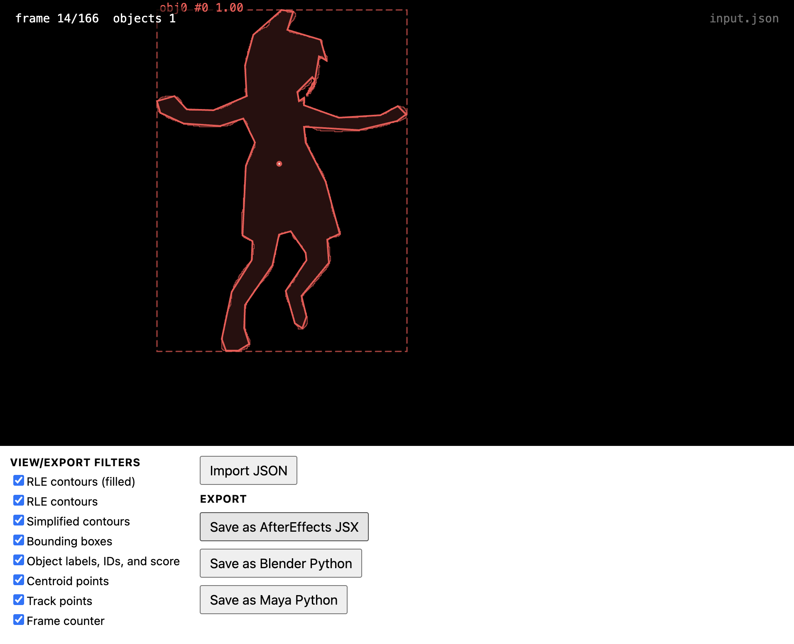
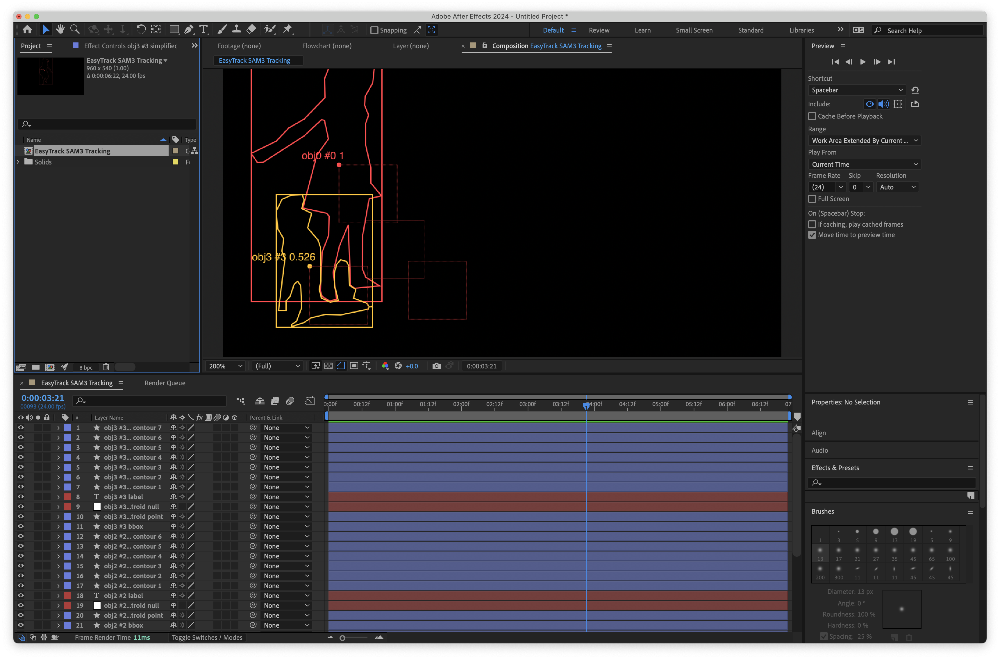

# p5 EasyTrack Viewer

This p5.js utility loads and displays JSONs produced by other Easy apps. Additionally, it can re-export the data for AfterEffects, Blender, and Maya. 

---

## In After Effects 

Load the exported file (e.g. `easytrack_aftereffects.jsx`) into After Effects with: 

* File > Scripts > Run Script File...

